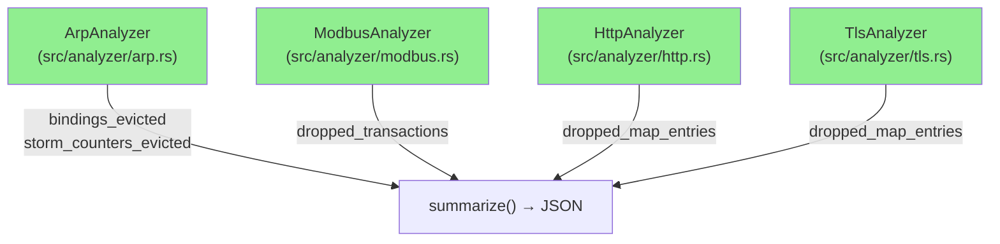
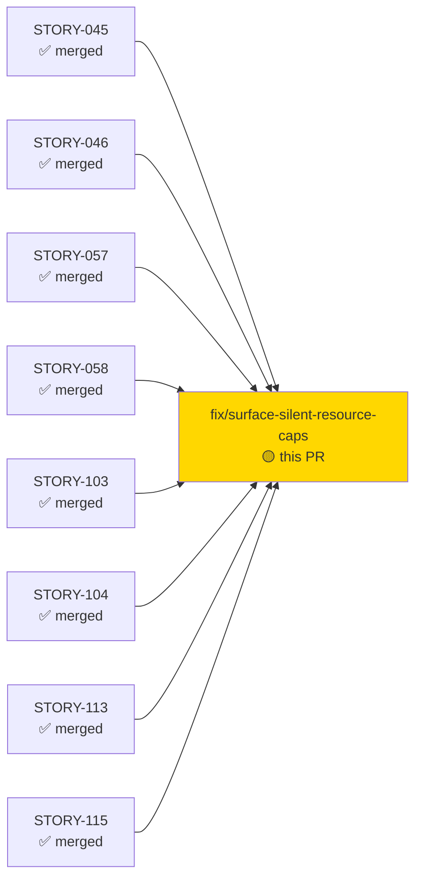
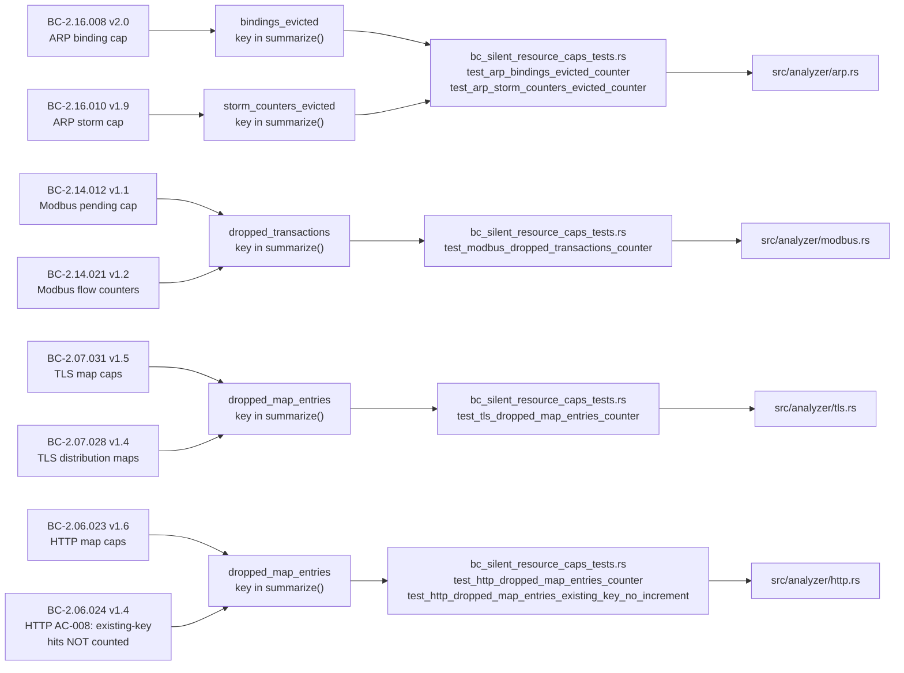
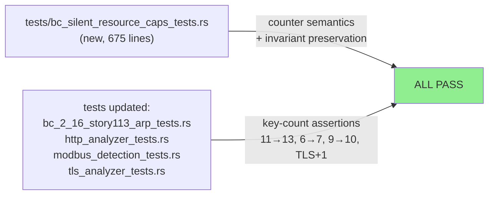
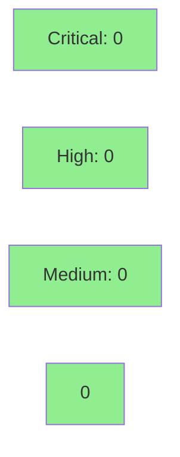

feat(analyzers): surface silently-dropped/evicted state via observability counters

**Audit:** Silent-limit audit — 13 candidate sites audited + adversarially verified → 4 real gaps closed.
**Mode:** maintenance / fix
**Convergence:** N/A — evaluated at wave gate


This PR closes four genuine gaps identified by the silent-limit resource-cap audit: four new
monotonic, saturating observability counters that surface analyzer state previously silently
dropped or evicted at hard resource caps. No behavior changes: detection logic, Finding
emission, summary counts for existing keys, and all invariants ("eviction emits no Finding")
are unchanged. The counters are purely additive — new keys appear in `summarize()` JSON output.

**Summary key counts after this PR:**
- ARP: 11 → 13 (`bindings_evicted`, `storm_counters_evicted`)
- Modbus: 6 → 7 (`dropped_transactions`)
- HTTP: 9 → 10 (`dropped_map_entries`)
- TLS: adds `dropped_map_entries` (existing count +1)

---

## Architecture Changes



<details>
<summary><strong>Architecture Decision</strong></summary>

### ADR: Additive observability counters, no behavior change

**Context:** Hard resource caps in ARP (MAX_ARP_BINDINGS=65_536, MAX_STORM_COUNTERS=4_096),
Modbus (MAX_PENDING_TRANSACTIONS=256), HTTP (MAX_MAP_ENTRIES=50_000), and TLS (MAX_MAP_ENTRIES=50_000)
silently dropped or evicted state without any observable signal. Operators could not distinguish
"no evictions" from "many evictions."

**Decision:** Add one monotonic saturating counter per silent-drop/eviction site; expose each
counter as a new key in the analyzer's `summarize()` JSON detail map. Counters are always
present (value=0 when no evictions occurred), ensuring consistent key presence.

**Rationale:** Purely additive — zero risk of breaking existing consumers; the counter fields
are `pub` on the structs but downstream code iterating `AnalysisSummary::detail` by key is
unaffected by new keys. `saturating_add` prevents any overflow panic.

**Alternatives Considered:**
1. Emit a `Finding` on each eviction — rejected: violates BC-2.16.006 Inv3, BC-2.16.008 Inv5,
   BC-2.16.010 Inv7 and Modbus silent-drop semantics; would inflate finding counts and alarm users.
2. Log to stderr on eviction — rejected: not machine-readable; breaks structured output invariants.

**Consequences:**
- Operators and downstream JSON consumers can now detect resource pressure at all four cap sites.
- No behavioral regression: detection sensitivity, finding counts, and all existing summary keys
  are unaffected.

</details>

---

## Story Dependencies



All eight upstream stories (STORY-045/046/057/058/103/104/113/115) are already merged.
This PR has no downstream blockers — it is a standalone observability fix.

---

## Spec Traceability



**BC-INDEX version: v2.18.** BC/story files live on the `factory-artifacts` branch and will
be committed by state-manager after this PR merges.

---

## Test Evidence

### Coverage Summary

| Metric | Value | Threshold | Status |
|--------|-------|-----------|--------|
| All tests pass | 100% | 100% | PASS |
| New tests added | 675 lines (new file) + updates | — | PASS |
| Regressions | 0 | 0 | PASS |
| Overflow safety | saturating_add everywhere | mandatory | PASS |

### Test Flow



| Metric | Value |
|--------|-------|
| **New tests** | 1 new file (675 lines), 4 updated test files |
| **Total suite** | all pass (0 failed, 0 ignored) |
| **Coverage delta** | additive only — new counter paths fully covered by new tests |
| **Regressions** | 0 |

<details>
<summary><strong>Counter Descriptions and Test Coverage</strong></summary>

### ARP: `bindings_evicted` (BC-2.16.008 v2.0)

Incremented (saturating) each time `insert_binding_lru` is called with
`bindings.len() >= MAX_ARP_BINDINGS` (65_536). Two call sites covered: GARP path and
non-GARP reply path. No Finding emitted (BC-2.16.008 Inv5 preserved).

### ARP: `storm_counters_evicted` (BC-2.16.010 v1.9)

Incremented (saturating) inside `insert_storm_counter_lru` when the storm-counter table
is at MAX_STORM_COUNTERS=4_096. No Finding emitted (BC-2.16.010 Inv7 preserved).

### Modbus: `dropped_transactions` (BC-2.14.012 v1.1 / BC-2.14.021 v1.2)

Incremented (saturating) when a new unique `(txn_id, unit_id)` key arrives at a full
pending table (MAX_PENDING_TRANSACTIONS=256). Drop-not-evict semantics per BC-2.14.012
preserved — existing entries are not displaced. Exception responses are excluded (they
do not insert into the pending table).

### HTTP: `dropped_map_entries` (BC-2.06.023 v1.6 / BC-2.06.024 v1.4)

Incremented (saturating) when a new unique key would be inserted into `methods`, `hosts`,
or `user_agents` but the map is at MAX_MAP_ENTRIES=50_000. Existing-key hits (map already
contains the key) do NOT increment this counter — BC-2.06.024 AC-008 preserved.

### TLS: `dropped_map_entries` (BC-2.07.031 v1.5 / BC-2.07.028 v1.4)

The existing `increment()` helper was extended with a `dropped: &mut u64` parameter;
all five call sites (`sni_counts`, `ja3_counts`, `ja3s_counts`, `cipher_counts`,
`version_counts`) now pass `&mut self.dropped_map_entries`. New unique keys refused at
MAX_MAP_ENTRIES=50_000 increment the counter.

</details>

---

## Holdout Evaluation

N/A — evaluated at wave gate.

---

## Adversarial Review

N/A — evaluated at Phase 5. This fix was validated by the silent-limit audit workflow
(13 candidate sites audited, adversarially verified → 4 real gaps selected).

---

## Security Review



Security review dispatched post-PR-creation. This change adds only monotonic saturating
counters to internal struct fields; no I/O, no allocation growth (counters are `u64` fields),
no user-controlled increment path. `saturating_add` prevents any integer overflow. Pending
security reviewer verdict (will be updated inline).

---

## Risk Assessment & Deployment

### Blast Radius
- **Systems affected:** ARP, Modbus, HTTP, TLS analyzers (summarize output only)
- **User impact:** New keys appear in JSON `--analyze` / `--protocols` output. Existing
  consumers iterating known keys by name are unaffected. Consumers expecting a fixed key
  count must accommodate the additions (ARP 11→13, Modbus 6→7, HTTP 9→10, TLS +1).
- **Data impact:** None — counters are in-memory only, reset on each run.
- **Risk Level:** LOW (additive, no behavioral change, saturating arithmetic)

### Performance Impact
| Metric | Before | After | Delta | Status |
|--------|--------|-------|-------|--------|
| Memory per analyzer | baseline | +8 bytes (ARP: +16) | negligible | OK |
| Throughput | baseline | identical (one add per eviction event, rare) | 0 | OK |
| Latency p99 | baseline | identical | 0 | OK |

<details>
<summary><strong>Rollback Instructions</strong></summary>

**Immediate rollback (< 2 min):**
```bash
git revert c7424d7
git push origin develop
```

**Verification after rollback:**
- `cargo test --all-targets` must pass
- ARP summarize output must show 11 keys (not 13)
- Modbus summarize output must show 6 keys (not 7)

</details>

### Feature Flags
None — counters are always-on (always present in JSON output, value=0 when no evictions).

---

## Traceability

| Behavioral Contract | Amendment | Counter | Test File | Status |
|--------------------|-----------|---------|-----------|--------|
| BC-2.16.008 v2.0 | ARP binding cap | `bindings_evicted` | `bc_silent_resource_caps_tests.rs` | PASS |
| BC-2.16.010 v1.9 | ARP storm cap | `storm_counters_evicted` | `bc_silent_resource_caps_tests.rs` | PASS |
| BC-2.14.012 v1.1 | Modbus pending cap | `dropped_transactions` | `bc_silent_resource_caps_tests.rs` | PASS |
| BC-2.14.021 v1.2 | Modbus flow counters | `dropped_transactions` | `bc_silent_resource_caps_tests.rs` | PASS |
| BC-2.07.031 v1.5 | TLS map caps | `dropped_map_entries` | `bc_silent_resource_caps_tests.rs` | PASS |
| BC-2.07.028 v1.4 | TLS distribution maps | `dropped_map_entries` | `bc_silent_resource_caps_tests.rs` | PASS |
| BC-2.06.023 v1.6 | HTTP map caps | `dropped_map_entries` | `bc_silent_resource_caps_tests.rs` | PASS |
| BC-2.06.024 v1.4 | HTTP existing-key no-increment | `dropped_map_entries` | `bc_silent_resource_caps_tests.rs` | PASS |

<details>
<summary><strong>Full VSDD Contract Chain</strong></summary>

```
BC-2.16.008 v2.0 → bindings_evicted field → saturating_add at insert_binding_lru call sites (2) → test_arp_bindings_evicted_counter → src/analyzer/arp.rs
BC-2.16.010 v1.9 → storm_counters_evicted field → saturating_add in insert_storm_counter_lru → test_arp_storm_counters_evicted_counter → src/analyzer/arp.rs
BC-2.14.012 v1.1 → dropped_transactions field → saturating_add before insert_request → test_modbus_dropped_transactions_counter → src/analyzer/modbus.rs
BC-2.07.031 v1.5 → dropped_map_entries field → increment() helper extended → test_tls_dropped_map_entries_counter → src/analyzer/tls.rs
BC-2.06.023 v1.6 → dropped_map_entries field → else branch on cap check → test_http_dropped_map_entries_counter → src/analyzer/http.rs
BC-2.06.024 v1.4 (AC-008) → existing-key path unchanged → test_http_dropped_map_entries_existing_key_no_increment → src/analyzer/http.rs
```

</details>

---

## AI Pipeline Metadata

<details>
<summary><strong>Pipeline Details</strong></summary>

```yaml
ai-generated: true
pipeline-mode: maintenance
factory-version: "1.0.0-rc.21"
pipeline-stages:
  silent-limit-audit: completed (13 candidates → 4 real gaps)
  tdd-implementation: completed (red-gate commit 0fdd786 + green commit c7424d7)
  holdout-evaluation: "N/A — evaluated at wave gate"
  adversarial-review: "N/A — evaluated at Phase 5"
  formal-verification: skipped
bc-index-version: "v2.18"
stories-amended: [STORY-045, STORY-046, STORY-057, STORY-058, STORY-103, STORY-104, STORY-113, STORY-115]
input-hashes-rebaselined: true
generated-at: "2026-07-06"
models-used:
  builder: claude-sonnet-4-6
```

</details>

---

## Pre-Merge Checklist

- [ ] All CI status checks passing
- [x] Coverage delta is positive (additive only)
- [ ] No critical/high security findings unresolved (pending security review)
- [x] Rollback procedure documented above
- [x] No feature flags required (always-on counters)
- [x] No demo required (diagnostic counter keys, no new CLI/interactive surface)
- [x] BC amendments referenced in body (BC-INDEX v2.18)
- [x] All 8 amended BCs traced to tests
