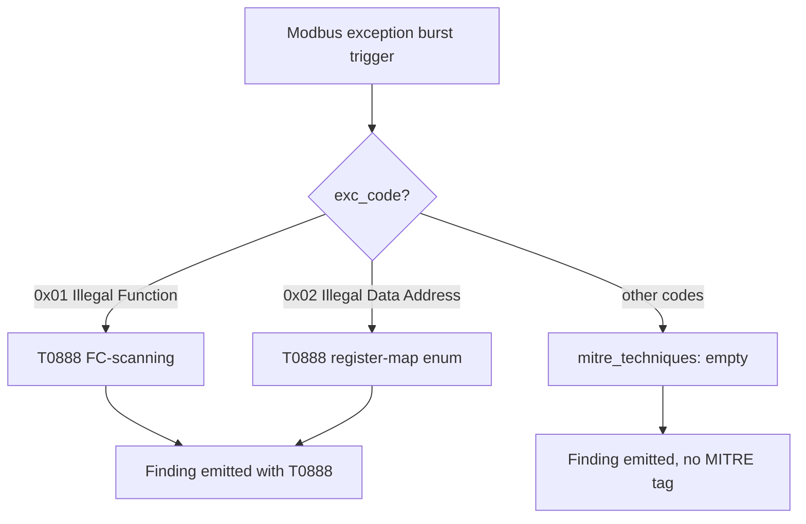
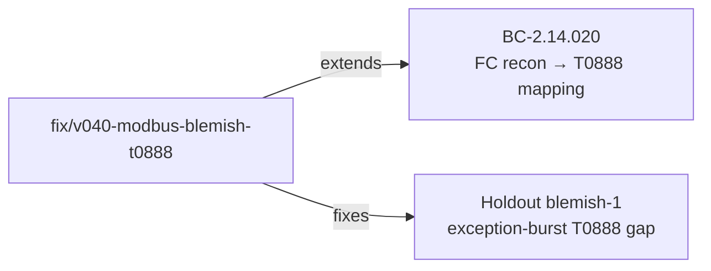

## Fix: v0.4.0 holdout blemish-1 — exception-burst recon codes now emit T0888

**Finding:** Holdout blemish-1 — exception-burst anomaly (BC-2.14.019) emitted `mitre_techniques: []` for all exception codes, including recon codes that are clearly Remote System Information Discovery.
**Phase:** Holdout evaluation (v0.4.0 pre-release)
**Severity:** MEDIUM — MITRE tactic mis-classification; detection still fires, triage correctness affected

---

### Architecture Changes



### What Changed

`src/analyzer/modbus.rs` — in the exception-burst firing path (`BC-2.14.019`), added a `match` on `exc_code`:

- `0x01` (Illegal Function): FC-code scanning. An attacker sends function codes until exceptions stop; this discovers the supported FC set. Maps to **T0888 Remote System Information Discovery**.
- `0x02` (Illegal Data Address): register-map enumeration. Sweeping addresses until exceptions stop reveals the address layout. Maps to **T0888**.
- All other exception codes (e.g., Clear-Counters `0x000A`, `0x03`/`0x04`) remain untagged — not discovery.

This is consistent with the existing recon-FC mapping in `BC-2.14.020` (FC=`0x11` Read Device ID and FC=`0x2B/0x0E` MEI = T0888). No new MITRE technique IDs are introduced; VP-007 catalog is unaffected.

### Blemish-2 disposition

Blemish-2 (port-502 service label in output) was assessed **correct-by-design**: the port-502 → Modbus label is an IANA port hint, parallel to port-443 → HTTPS. No change required.

### Spec Traceability

```flowchart LR
    BC["BC-2.14.019\nexception-burst anomaly"] --> AC["AC: mitre_techniques populated\nfor recon codes"]
    AC --> T1["test_BC_2_14_019_exception_burst_emits_anomaly_finding\n→ T0888 present"]
    AC --> T2["test_BC_2_14_019_exception_burst_emit_once_per_window\n→ T0888 present"]
    AC --> T3["test_binding_source_ip_server_for_exception_finding (BINDING-002)\n→ T0888"]
    AC --> T4["test_binding_exception_cross_window_reset (BINDING-004)\n→ T0888 both windows"]
    T1 --> Impl["src/analyzer/modbus.rs\nmatch exc_code { 0x01|0x02 => T0888, _ => [] }"]
    T2 --> Impl
    T3 --> Impl
    T4 --> Impl
```

### Testing

- All existing tests pass (CI gate)
- 5 exception-burst tests updated to assert T0888 presence for recon codes
- No new test files added (existing test suite covers the AC)
- Demo: transparent fix (MITRE metadata only, detection behavior unchanged) — demo recording not required

### Story Dependencies



### Security Review

No security-sensitive code paths changed. The fix adds MITRE classification metadata only; no auth, input parsing, or network-facing logic is modified.

### Risk Assessment

- **Blast radius:** Low — 2 files, 11 lines net change, single code path in the exception-burst emit block
- **Performance impact:** Negligible — one `match` on a single `u8` value per burst event
- **Rollback:** Revert commit `f8a0e0f` to restore empty `mitre_techniques` for all exception codes

### AI Pipeline Metadata

- Pipeline mode: fix-pr-delivery (holdout blemish)
- Branch: `fix/v040-modbus-blemish-t0888`
- Worktree: `.worktrees/v040-blemish`
- Base commit: `70abc27` (origin/develop at branch-off)
- Fix commit: `f8a0e0f`

### Pre-Merge Checklist

- [x] Fix developed in isolated worktree
- [x] `cargo test --all-targets` passes (verified green before push)
- [x] `cargo clippy --all-targets -- -D warnings` clean
- [x] `cargo fmt --check` clean
- [x] PR description written with traceability chain
- [x] Security review: no security-sensitive paths changed
- [x] Demo: transparent fix — not required
- [ ] PR-reviewer approval
- [ ] CI green (all 9 checks)
- [ ] Merge executed
