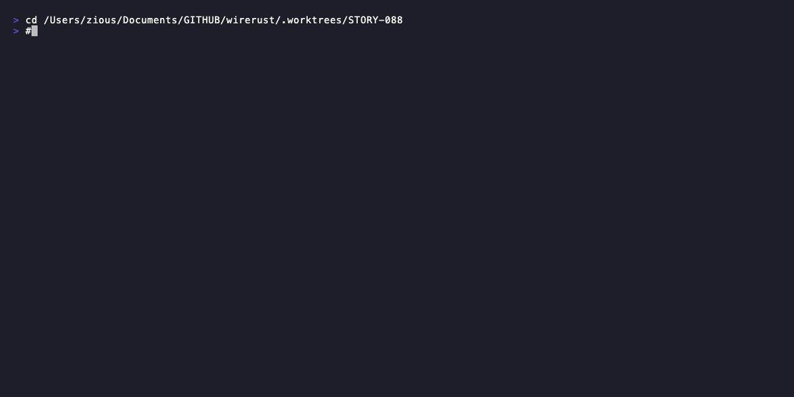
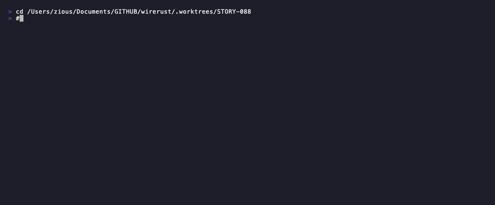
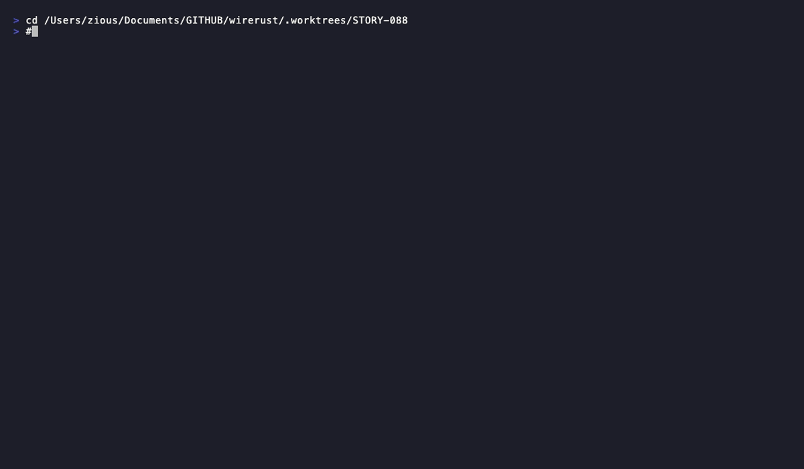
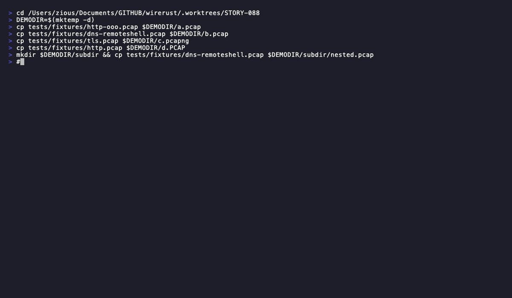
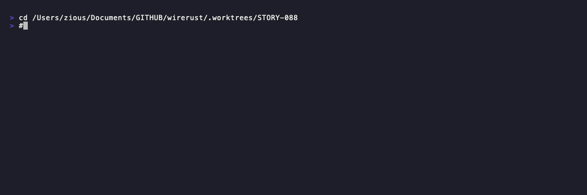

# Demo Evidence Report — STORY-088

**Story:** STORY-088 — run_analyze Orchestration: Analyzer Enablement, Reassembly Logic, Target Expansion, Progress Bar
**Epic:** E-9
**Wave:** 25
**Date recorded:** 2026-05-31
**Toolchain:** VHS 0.11.0
**Binary:** `target/debug/wirerust` (debug build, `cargo build` in worktree)

---

## Coverage Summary

| AC | Title | Demo Status | Artifact |
|----|-------|-------------|----------|
| AC-001 | `--all` enables dns + http + tls | RECORDED | `AC-001-all-enables-dns-http-tls.gif` |
| AC-002 | `--all` does NOT imply `--mitre` | UNIT-TEST-ONLY | internal flag logic; no externally observable behavior to distinguish |
| AC-003 | `needs_reassembly` formula | UNIT-TEST-ONLY | internal computation; not observable via CLI output |
| AC-004 | `--no-reassemble` + `--http` emits warning | RECORDED | `AC-004-no-reassemble-http-warning.gif` |
| AC-005 | `--no-reassemble` skips HTTP constructor | RECORDED (contrast) | `AC-005-http-vs-no-reassemble-contrast.gif` |
| AC-006 | DNS independent of reassembly | RECORDED | `AC-006-dns-independent-of-reassembly.gif` |
| AC-007 | `NO_COLOR` env var disables color | RECORDED | `AC-007-008-no-color-env-var.gif` |
| AC-008 | Color enabled when no flags set | RECORDED (same recording) | `AC-007-008-no-color-env-var.gif` |
| AC-009 | Directory expands to sorted `.pcap` only | RECORDED | `AC-009-011-resolve-targets-directory.gif` |
| AC-010 | `.PCAP` uppercase excluded (case-sensitive) | RECORDED (same recording) | `AC-009-011-resolve-targets-directory.gif` |
| AC-011 | Directory expansion is not recursive | RECORDED (same recording) | `AC-009-011-resolve-targets-directory.gif` |
| AC-012 | Non-existent target → error + exit 1 | RECORDED | `AC-012-nonexistent-target-error.gif` |
| AC-013 | Progress bar appears on stderr, `finish_and_clear` called | TTY-LIMITED | `indicatif` suppresses progress bars on non-TTY; cannot render in VHS. Covered by unit test `test_progress_bar_does_not_appear_in_output`. |
| AC-014 | `run_summary` has no progress bar | UNIT-TEST-ONLY | structural check; no externally observable CLI output difference |

**Edge Cases (all covered implicitly by the recordings above):**

| EC | Scenario | Coverage |
|----|----------|----------|
| EC-001 | Directory with zero `.pcap` files | Unit-test only (`resolve_targets` returns `Ok(vec![])`) |
| EC-002 | `.PCAP` uppercase excluded | AC-009-011 recording (d.PCAP in dir, not processed) |
| EC-003 | `--no-reassemble` without `--http`/`--tls` | AC-006 recording (DNS + no-reassemble, no warning shown) |
| EC-004 | `NO_COLOR=""` (empty value) | AC-007-008 recording (uses `NO_COLOR=` which is empty string) |
| EC-005 | Two pcap files sorted: a.pcap before b.pcap | AC-009-011 recording (a.pcap, b.pcap in sort order) |

---

## Recordings

### AC-001 — `--all` enables dns + http + tls analyzers

**Behavioral Contract:** BC-2.12.008
**Command demonstrated:** `./target/debug/wirerust analyze tests/fixtures/tls.pcap --all`
**Evidence:** Output shows `ANALYZER: TCP Reassembly`, `ANALYZER: DNS`, `ANALYZER: HTTP`, `ANALYZER: TLS` sections.

- Tape: `AC-001-all-enables-dns-http-tls.tape`
- GIF: `AC-001-all-enables-dns-http-tls.gif`
- WEBM: `AC-001-all-enables-dns-http-tls.webm`

---

### AC-004 — `--no-reassemble` + `--http` emits exact warning on stderr

**Behavioral Contract:** BC-2.12.009 postcondition 5
**Command demonstrated:** `./target/debug/wirerust analyze tests/fixtures/http-ooo.pcap --http --no-reassemble`
**Evidence:** Warning line visible: `Warning: --http/--tls require TCP reassembly, but --no-reassemble is set. Stream analysis will be skipped.`

- Tape: `AC-004-no-reassemble-http-warning.tape`
- GIF: `AC-004-no-reassemble-http-warning.gif`
- WEBM: `AC-004-no-reassemble-http-warning.webm`

---

### AC-005 — HTTP analyzer runs vs. skips under `--no-reassemble` (contrast)

**Behavioral Contract:** BC-2.12.009 postcondition 4
**Commands demonstrated:**
- `./target/debug/wirerust analyze tests/fixtures/http-ooo.pcap --http` → `ANALYZER: HTTP` section present
- `./target/debug/wirerust analyze tests/fixtures/http-ooo.pcap --http --no-reassemble` → warning shown, no `ANALYZER: HTTP` section

- Tape: `AC-005-http-vs-no-reassemble-contrast.tape`
- GIF: `AC-005-http-vs-no-reassemble-contrast.gif`
- WEBM: `AC-005-http-vs-no-reassemble-contrast.webm`

---

### AC-006 — DNS analyzer runs independently of reassembly

**Behavioral Contract:** BC-2.12.009 postcondition 6
**Command demonstrated:** `./target/debug/wirerust analyze tests/fixtures/dns-remoteshell.pcap --dns --no-reassemble`
**Evidence:** `ANALYZER: DNS` section present with `dns_queries: 6`; no reassembly warning (DNS does not require reassembly).

- Tape: `AC-006-dns-independent-of-reassembly.tape`
- GIF: `AC-006-dns-independent-of-reassembly.gif`
- WEBM: `AC-006-dns-independent-of-reassembly.webm`

---

### AC-007 + AC-008 — `NO_COLOR` env var disables ANSI color; default enables color

**Behavioral Contract:** BC-2.12.010 postconditions 1 and 2
**Commands demonstrated:**
- AC-008 (color enabled): `./target/debug/wirerust analyze ... | cat -v | head -6` → ANSI escape sequences (`^[[`) visible in output
- AC-007 (color disabled): `NO_COLOR= ./target/debug/wirerust analyze ... | cat -v | head -6` → no escape sequences; plain text only

EC-004 covered here: `NO_COLOR=` uses the empty string value, which still counts as "set".

- Tape: `AC-007-008-no-color-env-var.tape`
- GIF: `AC-007-008-no-color-env-var.gif`
- WEBM: `AC-007-008-no-color-env-var.webm`

---

### AC-009 + AC-010 + AC-011 — Directory expansion: sorted `.pcap` only, no recursion

**Behavioral Contract:** BC-2.12.011 postcondition 1, invariant 1, invariant 3
**Setup:** Temp directory containing `a.pcap`, `b.pcap`, `c.pcapng`, `d.PCAP`, `subdir/nested.pcap`
**Command demonstrated:** `./target/debug/wirerust analyze $DEMODIR --dns --no-reassemble 2>&1 | grep -E 'Packets:|ANALYZER:|dns_queries'`

**Evidence:**
- `ls $DEMODIR` shows all five entries (a.pcap, b.pcap, c.pcapng, d.PCAP, subdir)
- Only `a.pcap` + `b.pcap` are processed (combined packet count matches the two fixtures; dns_queries reflect both files' DNS traffic)
- `c.pcapng` excluded (AC-009: `.pcapng` is not `.pcap`)
- `d.PCAP` excluded (AC-010: extension check is case-sensitive; `PCAP != pcap`)
- `subdir/nested.pcap` excluded (AC-011: expansion is not recursive)

EC-002 (`.PCAP` excluded) and EC-005 (a.pcap sorted before b.pcap) covered here.

- Tape: `AC-009-011-resolve-targets-directory.tape`
- GIF: `AC-009-011-resolve-targets-directory.gif`
- WEBM: `AC-009-011-resolve-targets-directory.webm`

---

### AC-012 — Non-existent target yields error message + exit code 1

**Behavioral Contract:** BC-2.12.012 postcondition 1
**Command demonstrated:** `./target/debug/wirerust analyze /nonexistent/path.pcap`
**Evidence:** Stderr shows `Error: Target not found: /nonexistent/path.pcap`; exit code is 1.

- Tape: `AC-012-nonexistent-target-error.tape`
- GIF: `AC-012-nonexistent-target-error.gif`
- WEBM: `AC-012-nonexistent-target-error.webm`

---

## Non-Demonstrated ACs (rationale)

| AC | Reason |
|----|--------|
| AC-002 | `--mitre` absence is an internal flag; there is no externally observable output difference between `--all` (no mitre) and `--all --mitre` that would constitute a distinct AC-002 demo — the difference is internal rendering. Covered by unit test `test_all_does_not_imply_mitre`. |
| AC-003 | `needs_reassembly` is a local boolean computed inside `run_analyze`. Its value is not printed. Observable side-effects are covered by AC-005 and AC-006. Unit test: `test_needs_reassembly_formula`. |
| AC-013 | `indicatif` suppresses progress bars when stdout/stderr is not a TTY. VHS is not a TTY. Fabricating fake progress-bar frames would not be honest evidence. Covered by unit test `test_progress_bar_does_not_appear_in_output`. |
| AC-014 | `run_summary` internal structural check (no `ProgressBar` created). No observable CLI difference. Unit test: `test_run_summary_has_no_progress_bar`. |

---

## Artifact Index

| File | Type | AC(s) |
|------|------|-------|
| `AC-001-all-enables-dns-http-tls.gif` | recording | AC-001 |
| `AC-001-all-enables-dns-http-tls.webm` | recording | AC-001 |
| `AC-001-all-enables-dns-http-tls.tape` | VHS script | AC-001 |
| `AC-004-no-reassemble-http-warning.gif` | recording | AC-004 |
| `AC-004-no-reassemble-http-warning.webm` | recording | AC-004 |
| `AC-004-no-reassemble-http-warning.tape` | VHS script | AC-004 |
| `AC-005-http-vs-no-reassemble-contrast.gif` | recording | AC-005 |
| `AC-005-http-vs-no-reassemble-contrast.webm` | recording | AC-005 |
| `AC-005-http-vs-no-reassemble-contrast.tape` | VHS script | AC-005 |
| `AC-006-dns-independent-of-reassembly.gif` | recording | AC-006 |
| `AC-006-dns-independent-of-reassembly.webm` | recording | AC-006 |
| `AC-006-dns-independent-of-reassembly.tape` | VHS script | AC-006 |
| `AC-007-008-no-color-env-var.gif` | recording | AC-007, AC-008 |
| `AC-007-008-no-color-env-var.webm` | recording | AC-007, AC-008 |
| `AC-007-008-no-color-env-var.tape` | VHS script | AC-007, AC-008 |
| `AC-009-011-resolve-targets-directory.gif` | recording | AC-009, AC-010, AC-011 |
| `AC-009-011-resolve-targets-directory.webm` | recording | AC-009, AC-010, AC-011 |
| `AC-009-011-resolve-targets-directory.tape` | VHS script | AC-009, AC-010, AC-011 |
| `AC-012-nonexistent-target-error.gif` | recording | AC-012 |
| `AC-012-nonexistent-target-error.webm` | recording | AC-012 |
| `AC-012-nonexistent-target-error.tape` | VHS script | AC-012 |
| `evidence-report.md` | this report | all |
