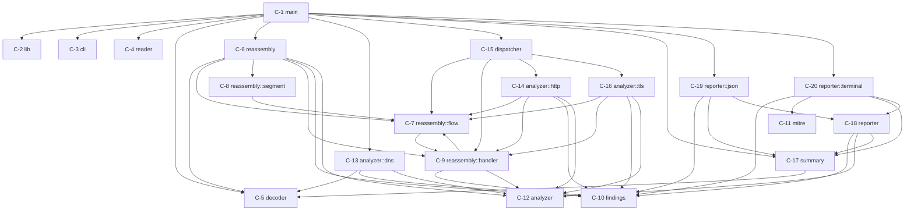
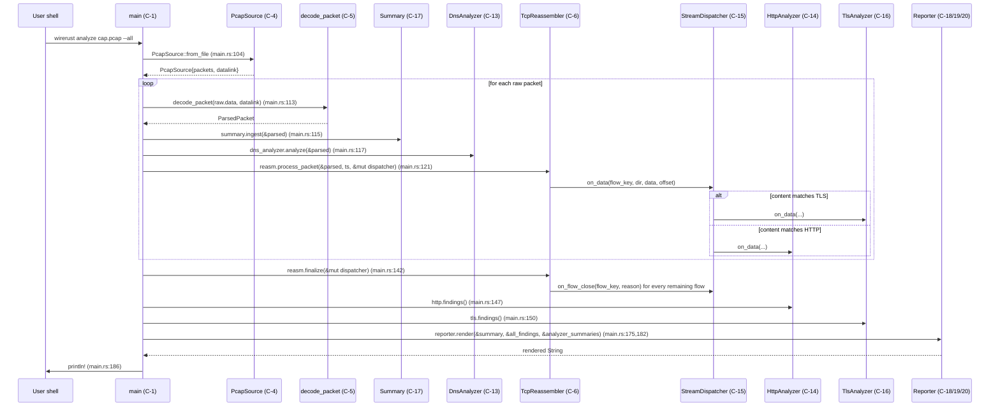

# Recovered Architecture: wirerust

> Recovered by Dark Factory Phase 0b (semport brownfield-ingest, Pass 1)
> Source codebase: `/Users/zious/Documents/GITHUB/wirerust/`
> Date: 2026-05-19
> Pass: 1 (Architecture) — Phase A broad-sweep, round 1
> Confidence: HIGH (every component, edge, and exported symbol grounded in `src/*.rs`; cycle scan done by reading every `use crate::` edge in the tree; CLI line numbers cited)

Builds on `wirerust-pass-0-inventory.md` (file tree, dependency catalog, LOC, test inventory). This pass adds: layered component model, dependency DAG with cycle scan, library export surface, data-flow wiring with file:line citations, layering-violation audit, architecture smells.

---

## 1. Components

Every Rust module in `src/` is a component. IDs are stable for downstream passes.

| #    | Component             | Path                              | Layer                | Purpose                                                                                                                                                | Dependents                       | Dependencies                                                          |
|------|-----------------------|-----------------------------------|----------------------|--------------------------------------------------------------------------------------------------------------------------------------------------------|----------------------------------|-----------------------------------------------------------------------|
| C-1  | main (binary entry)   | `src/main.rs`                     | L0 CLI / Entry       | `fn main()` — parses `Cli`, builds reassembler+dispatcher+analyzers, drives the per-packet loop, calls reporters, prints to stdout.                    | (binary; nothing depends on it)  | C-2, C-3, C-4, C-5, C-6, C-7, C-8, C-13, C-15, C-16, C-17, C-19      |
| C-2  | lib (crate root)      | `src/lib.rs`                      | L0 CLI / Entry       | Re-exports the 10 top-level modules as the public library surface. Sole purpose is `pub mod` declarations.                                             | C-1, all `tests/*.rs`            | (none — just `pub mod` lines)                                         |
| C-3  | cli                   | `src/cli.rs`                      | L0 CLI / Entry       | `clap`-derive structs: `Cli`, `Commands::{Analyze, Summary}`, `OutputFormat`. Defines all flags and the two subcommands.                               | C-1, `tests/cli_tests.rs`        | `clap`                                                                |
| C-4  | reader                | `src/reader.rs`                   | L1 Ingest            | `PcapSource::from_file` / `from_pcap_reader`: wraps `pcap_file::PcapReader`, gates supported `DataLink` set (Ethernet/RAW/IPv4/IPv6/SLL).              | C-1, `tests/reader_tests.rs`     | `pcap-file`, `anyhow`                                                 |
| C-5  | decoder               | `src/decoder.rs`                  | L1 Ingest            | `decode_packet` slices L2-L4 via `etherparse`; emits `ParsedPacket {src_ip, dst_ip, protocol, transport, payload, packet_len}`.                        | C-1, C-9, C-10, C-12, C-15       | `etherparse`, `pcap-file::DataLink`, `serde`, `anyhow`                |
| C-6  | reassembly (engine)   | `src/reassembly/mod.rs`           | L2 Stream / Routing  | `TcpReassembler::{process_packet, expire_flows, finalize}` — main TCP reassembly loop, per-flow state, eviction, anomaly findings.                    | C-1, `tests/reassembly_engine_tests.rs` | C-5, C-9, C-10, C-11, C-12, atomic guard `CLOSE_FLOW_MISSING_WARNED` |
| C-7  | reassembly::flow      | `src/reassembly/flow.rs`          | L2 Stream / Routing  | `FlowKey` (canonicalized by `(ip,port)` tuple pair), `FlowState` machine, `FlowDirection`, `TcpFlow` per-direction state.                              | C-6, C-8, C-10, C-13, C-16, C-17, C-19 | C-10                                                                |
| C-8  | reassembly::segment   | `src/reassembly/segment.rs`       | L2 Stream / Routing  | `InsertResult` enum + `FlowDirection::insert_segment` first-wins overlap policy with depth / segment / window caps.                                    | C-6                              | C-7, atomic guard `ISN_MISSING_WARNED`                                |
| C-9  | reassembly::handler   | `src/reassembly/handler.rs`       | L2 Stream / Routing  | `StreamHandler` (sink trait: `on_data`, `on_flow_close`), `StreamAnalyzer: StreamHandler` (adds `name`/`summarize`/`findings`), `Direction`, `CloseReason`. | C-6, C-13, C-16, C-17, C-19      | C-7, C-12, C-15                                                       |
| C-10 | findings              | `src/findings.rs`                 | L3 Domain Analysis   | Output domain model: `Verdict`, `Confidence`, `ThreatCategory`, `Finding {category, verdict, confidence, summary, evidence, mitre_technique, source_ip, timestamp}`. Doc comment encodes "raw text — not safe for terminal display" contract (per ADR 0003). | C-6, C-9, C-15, C-16, C-17, C-18, C-19, C-20 | `serde`, `chrono`                                                  |
| C-11 | mitre                 | `src/mitre.rs`                    | L3 Domain Analysis   | `#[non_exhaustive] MitreTactic` enum, `all_tactics_in_report_order`, `technique_info`/`name`/`tactic` — static `match` over ~16 IDs incl. 4 ICS.        | C-20                             | (stdlib only)                                                         |
| C-12 | analyzer (trait root) | `src/analyzer/mod.rs`             | L3 Domain Analysis   | `pub mod {dns,http,tls}`. Defines `AnalysisSummary {analyzer_name, packets_analyzed, detail: HashMap<String, serde_json::Value>}` and the packet-level `ProtocolAnalyzer` trait. | C-1, C-6, C-9, C-13, C-15, C-16, C-17, C-18, C-19, C-20 | C-5, C-10, `serde`                                                  |
| C-13 | analyzer::dns         | `src/analyzer/dns.rs`             | L3 Domain Analysis   | `DnsAnalyzer` — packet-level (`ProtocolAnalyzer` impl). Counts queries/responses; `analyze()` returns empty `Vec` (no findings emitted; see Pass 0 question #9). | C-1, `tests/analyzer_tests.rs`, `tests/integration_test.rs` | C-5, C-10, C-12, `serde_json`                                       |
| C-14 | analyzer::http        | `src/analyzer/http.rs`            | L3 Domain Analysis   | `HttpAnalyzer` — stream-level (`StreamAnalyzer` impl). HTTP/1.x parse via `httparse`; detects path traversal, web-shell URIs, unusual methods, missing/odd Host, long URIs. | C-1, C-15, `tests/http_*.rs`   | C-7, C-9, C-10, C-12, `httparse`, `serde_json`                        |
| C-15 | dispatcher            | `src/dispatcher.rs`               | L2 Stream / Routing  | `StreamDispatcher` — `StreamHandler` impl that classifies each flow content-first (TLS `0x16 0x03` / HTTP method tokens) with port fallback (443/8443/80/8080), caches `DispatchTarget` per `FlowKey`, forwards `on_data`/`on_flow_close` to wrapped `HttpAnalyzer` / `TlsAnalyzer`. Subject of ADR 0001. | C-1, `tests/dispatcher_tests.rs` | C-7, C-9, C-14, C-17                                                  |
| C-16 | analyzer::tls         | `src/analyzer/tls.rs`             | L3 Domain Analysis   | `TlsAnalyzer` — stream-level. TLS record framing via `tls-parser`, ClientHello/ServerHello parse, SNI extraction (with control-byte flagging), JA3/JA3S md5 fingerprints, weak/null/anon/export cipher & SSL 2.0/3.0 deprecation detection. | C-1, C-15, `tests/tls_*.rs`     | C-7, C-9, C-10, C-12, `tls-parser`, `md-5`, `serde_json`              |
| C-17 | summary               | `src/summary.rs`                  | L3 Domain Analysis   | `Summary {total_packets, total_bytes, skipped_packets, hosts, protocols, services}` — lightweight aggregation collector fed from each `decode_packet` result. | C-1, C-18, C-19, `tests/summary_tests.rs` | C-5, `serde`                                                       |
| C-18 | reporter (trait root) | `src/reporter/mod.rs`             | L4 Output            | `pub mod {json, terminal}`; defines `trait Reporter { fn render(&self, summary, findings, analyzer_summaries) -> String; }`.                          | C-1, C-19, C-20                  | C-10, C-12, C-17                                                      |
| C-19 | reporter::json        | `src/reporter/json.rs`            | L4 Output            | `JsonReporter` — `serde_json::to_string_pretty` over `{summary, findings, analyzers}`. Relies on serde's RFC 8259 escaping (per ADR 0003).             | C-1                              | C-10, C-17, C-18, `serde_json`                                        |
| C-20 | reporter::terminal    | `src/reporter/terminal.rs`        | L4 Output            | `TerminalReporter` — ANSI-coloured ASCII table (`owo-colors`), MITRE-tactic grouping. Defines the private `escape_for_terminal` C0+DEL+C1+backslash escape primitive (per ADR 0003). | C-1                              | C-10, C-11, C-17, C-18, `owo-colors`                                  |

20 components total. C-1 is the binary entry; C-2 is the library root (de-facto stable surface).

---

## 2. Component Map (Machine-Readable)

Purity rule applied: a component is `pure-core` only if it does no I/O, has no `unsafe`, holds no thread state, touches no globals, and is fully deterministic given inputs. Anything touching `std::fs`, `std::io`, `std::env`, `std::sync::atomic` globals, `eprintln!`, `println!`, `ProgressBar`, or platform clocks is `effectful-shell`. `mixed` is reserved for components that own a pure-core kernel plus a thin I/O wrapper; `opaque` would be a binary or generated component.

```yaml
components:
  - id: C-1
    name: "main"
    path: "src/main.rs"
    layer: "L0-cli-entry"
    purity: "effectful-shell"
    criticality: "HIGH"
    dependencies: ["C-2","C-3","C-4","C-5","C-6","C-7","C-8","C-13","C-15","C-16","C-17","C-19","C-20"]
    interfaces_provided: ["wirerust binary: `wirerust analyze`, `wirerust summary`"]
    interfaces_consumed: ["wirerust::* re-exports","clap","anyhow","indicatif","std::fs","std::path","std::env","println!","eprintln!"]
    confidence: "high"
    notes: "I/O orchestrator. ProgressBar stderr, println stdout, std::fs::read_dir, std::env::var('NO_COLOR'). Holds no state of its own beyond local mutables."

  - id: C-2
    name: "lib"
    path: "src/lib.rs"
    layer: "L0-cli-entry"
    purity: "pure-core"
    criticality: "HIGH"
    dependencies: []
    interfaces_provided: ["pub mod analyzer; cli; decoder; dispatcher; findings; mitre; reader; reassembly; reporter; summary"]
    interfaces_consumed: []
    confidence: "high"
    notes: "Pure re-export root; HIGH criticality because its module list is the public library API contract every integration test imports against."

  - id: C-3
    name: "cli"
    path: "src/cli.rs"
    layer: "L0-cli-entry"
    purity: "pure-core"
    criticality: "MEDIUM"
    dependencies: []
    interfaces_provided: ["Cli","Commands::{Analyze,Summary}","OutputFormat"]
    interfaces_consumed: ["clap::{Parser,Subcommand,ValueEnum}"]
    confidence: "high"
    notes: "Parse logic delegated to derive macros. `Cli::parse_from` is deterministic over argv."

  - id: C-4
    name: "reader"
    path: "src/reader.rs"
    layer: "L1-ingest"
    purity: "effectful-shell"
    criticality: "HIGH"
    dependencies: []
    interfaces_provided: ["RawPacket","PcapSource","PcapSource::from_file","PcapSource::from_pcap_reader"]
    interfaces_consumed: ["pcap_file::{PcapReader,DataLink}","std::fs::File","std::io::BufReader","anyhow"]
    confidence: "high"
    notes: "Reads from disk. Gates the supported DataLink whitelist — a defect here would either silently mis-decode or wrongly reject valid captures."

  - id: C-5
    name: "decoder"
    path: "src/decoder.rs"
    layer: "L1-ingest"
    purity: "pure-core"
    criticality: "HIGH"
    dependencies: []
    interfaces_provided: ["Protocol","TransportInfo","ParsedPacket","ParsedPacket::app_protocol_hint","decode_packet"]
    interfaces_consumed: ["etherparse::{SlicedPacket,NetSlice,TransportSlice}","pcap_file::DataLink"]
    confidence: "high"
    notes: "Per-link-type slicer. Pure: input `&[u8]` + DataLink → `Result<ParsedPacket>`. The L2-L4 boundary; a wrong field assignment here propagates into every analyzer."

  - id: C-6
    name: "reassembly"
    path: "src/reassembly/mod.rs"
    layer: "L2-stream-routing"
    purity: "effectful-shell"
    criticality: "HIGH"
    dependencies: ["C-5","C-7","C-8","C-9","C-10","C-12"]
    interfaces_provided: ["TcpReassembler","ReassemblyConfig","ReassemblyStats","process_packet","expire_flows","finalize","stats","findings","total_memory","summarize"]
    interfaces_consumed: ["std::sync::atomic::AtomicBool","std::collections::HashMap","eprintln!","StreamHandler dyn dispatch"]
    confidence: "high"
    notes: "564 LOC. Holds mutable `flows: HashMap<FlowKey, TcpFlow>`, `total_memory`, `findings`. Calls `eprintln!` once via the `CLOSE_FLOW_MISSING_WARNED` global atomic. Effectful by virtue of the global guard, not by I/O per se."

  - id: C-7
    name: "reassembly::flow"
    path: "src/reassembly/flow.rs"
    layer: "L2-stream-routing"
    purity: "pure-core"
    criticality: "HIGH"
    dependencies: ["C-9"]
    interfaces_provided: ["FlowKey","FlowKey::{new,lower_ip,lower_port,upper_ip,upper_port}","FlowState","FlowDirection","TcpFlow","TcpFlow::{new,set_initiator,direction,get_direction_mut,on_syn,on_syn_ack,on_data_without_syn,on_fin,on_rst,memory_used}"]
    interfaces_consumed: ["std::net::IpAddr","std::collections::BTreeMap","Direction"]
    confidence: "high"
    notes: "Pure state machine + canonicalization. The `(ip_a, port_a) <= (ip_b, port_b)` tuple comparison in `FlowKey::new` is the only correctness pin against the 'sort IPs and ports independently' bug."

  - id: C-8
    name: "reassembly::segment"
    path: "src/reassembly/segment.rs"
    layer: "L2-stream-routing"
    purity: "effectful-shell"
    criticality: "HIGH"
    dependencies: ["C-7"]
    interfaces_provided: ["InsertResult","FlowDirection::insert_segment","FlowDirection::flush_contiguous"]
    interfaces_consumed: ["std::sync::atomic::AtomicBool ISN_MISSING_WARNED","eprintln!"]
    confidence: "high"
    notes: "Pure-core kernel (segment placement, first-wins overlap), but owns the `ISN_MISSING_WARNED` global one-shot warning. Could be split, but kept as a single component matching the file."

  - id: C-9
    name: "reassembly::handler"
    path: "src/reassembly/handler.rs"
    layer: "L2-stream-routing"
    purity: "pure-core"
    criticality: "HIGH"
    dependencies: ["C-7","C-10","C-12"]
    interfaces_provided: ["Direction","CloseReason","trait StreamHandler","trait StreamAnalyzer"]
    interfaces_consumed: ["AnalysisSummary","Finding","FlowKey"]
    confidence: "high"
    notes: "29 LOC trait module — load-bearing extensibility seam (ADR 0002). HIGH criticality because every downstream analyzer is wired against these traits."

  - id: C-10
    name: "findings"
    path: "src/findings.rs"
    layer: "L3-domain"
    purity: "pure-core"
    criticality: "CRITICAL"
    dependencies: []
    interfaces_provided: ["Verdict","Confidence","ThreatCategory","Finding","Finding::Display (RAW — not terminal-safe)"]
    interfaces_consumed: ["chrono::{DateTime,Utc}","serde"]
    confidence: "high"
    notes: "CRITICAL: this is the output schema that downstream tooling and the JSON reporter rely on byte-for-byte. A defect would mean wrong forensic conclusions. Doc-comment on `impl Display for Finding` is the load-bearing raw-vs-display contract from ADR 0003."

  - id: C-11
    name: "mitre"
    path: "src/mitre.rs"
    layer: "L3-domain"
    purity: "pure-core"
    criticality: "MEDIUM"
    dependencies: []
    interfaces_provided: ["MitreTactic (#[non_exhaustive])","all_tactics_in_report_order","technique_info","technique_name","technique_tactic"]
    interfaces_consumed: ["std::fmt"]
    confidence: "high"
    notes: "Static lookup over ~16 IDs (incl. 4 ICS). Pure. MEDIUM because incorrect ID→tactic mapping would mis-group findings but not invent threats."

  - id: C-12
    name: "analyzer"
    path: "src/analyzer/mod.rs"
    layer: "L3-domain"
    purity: "pure-core"
    criticality: "HIGH"
    dependencies: ["C-5","C-10"]
    interfaces_provided: ["pub mod {dns,http,tls}","AnalysisSummary","trait ProtocolAnalyzer"]
    interfaces_consumed: ["serde","serde_json::Value (via HashMap value type)"]
    confidence: "high"
    notes: "HIGH: defines the packet-level analyzer contract (`ProtocolAnalyzer`) and the universal `AnalysisSummary` payload shape consumed by every reporter."

  - id: C-13
    name: "analyzer::dns"
    path: "src/analyzer/dns.rs"
    layer: "L3-domain"
    purity: "pure-core"
    criticality: "LOW"
    dependencies: ["C-5","C-10","C-12"]
    interfaces_provided: ["DnsAnalyzer","DnsAnalyzer::new","ProtocolAnalyzer impl"]
    interfaces_consumed: ["serde_json::json!"]
    confidence: "high"
    notes: "LOW: `analyze` returns empty Vec — currently a counter only (Pass 0 Q#9). If treated as findings-producing later, criticality should rise."

  - id: C-14
    name: "analyzer::http"
    path: "src/analyzer/http.rs"
    layer: "L3-domain"
    purity: "pure-core"
    criticality: "MEDIUM"
    dependencies: ["C-7","C-9","C-10","C-12"]
    interfaces_provided: ["HttpAnalyzer","StreamAnalyzer/StreamHandler impl","method_counts/user_agent_counts/etc. accessors","findings","summarize"]
    interfaces_consumed: ["httparse","serde_json::json!"]
    confidence: "high"
    notes: "Per-flow buffer up to 64 KB; bounded by `MAX_HEADER_BUF`, `MAX_URIS`, `MAX_MAP_ENTRIES`. Pure: no I/O, no globals."

  - id: C-15
    name: "dispatcher"
    path: "src/dispatcher.rs"
    layer: "L2-stream-routing"
    purity: "pure-core"
    criticality: "HIGH"
    dependencies: ["C-7","C-9","C-14","C-16"]
    interfaces_provided: ["StreamDispatcher","StreamDispatcher::new","unclassified_flows","StreamHandler impl","pub field http: Option<HttpAnalyzer>","pub field tls: Option<TlsAnalyzer>"]
    interfaces_consumed: ["HashMap<FlowKey, DispatchTarget>"]
    confidence: "high"
    notes: "HIGH: a misclassification here drops or misroutes whole flows. Pure: `classify` is a deterministic byte/port test."

  - id: C-16
    name: "analyzer::tls"
    path: "src/analyzer/tls.rs"
    layer: "L3-domain"
    purity: "pure-core"
    criticality: "MEDIUM"
    dependencies: ["C-7","C-9","C-10","C-12"]
    interfaces_provided: ["TlsAnalyzer","StreamAnalyzer/StreamHandler impl","sni_counts/cipher_counts/etc. accessors","findings","summarize"]
    interfaces_consumed: ["tls_parser","md5"]
    confidence: "high"
    notes: "Largest file (750 LOC). Pure. Bounded by MAX_BUF=65_536, MAX_RECORD_PAYLOAD=18_432."

  - id: C-17
    name: "summary"
    path: "src/summary.rs"
    layer: "L3-domain"
    purity: "pure-core"
    criticality: "MEDIUM"
    dependencies: ["C-5"]
    interfaces_provided: ["Summary","Summary::{new,ingest,unique_hosts,protocol_counts,service_counts}"]
    interfaces_consumed: ["std::collections::{HashMap,HashSet}","serde"]
    confidence: "high"
    notes: "Pure aggregation. Wide consumer (every reporter)."

  - id: C-18
    name: "reporter"
    path: "src/reporter/mod.rs"
    layer: "L4-output"
    purity: "pure-core"
    criticality: "MEDIUM"
    dependencies: ["C-10","C-12","C-17"]
    interfaces_provided: ["pub mod {json,terminal}","trait Reporter"]
    interfaces_consumed: []
    confidence: "high"

  - id: C-19
    name: "reporter::json"
    path: "src/reporter/json.rs"
    layer: "L4-output"
    purity: "pure-core"
    criticality: "MEDIUM"
    dependencies: ["C-10","C-17","C-18"]
    interfaces_provided: ["JsonReporter","Reporter impl"]
    interfaces_consumed: ["serde_json::{json,to_string_pretty}"]
    confidence: "high"
    notes: "Pure: takes refs, returns String. Escaping delegated to serde_json (RFC 8259)."

  - id: C-20
    name: "reporter::terminal"
    path: "src/reporter/terminal.rs"
    layer: "L4-output"
    purity: "pure-core"
    criticality: "MEDIUM"
    dependencies: ["C-10","C-11","C-17","C-18"]
    interfaces_provided: ["TerminalReporter","TerminalReporter::{use_color, show_mitre_grouping} pub fields","Reporter impl","private escape_for_terminal"]
    interfaces_consumed: ["owo_colors::OwoColorize"]
    confidence: "high"
    notes: "Owns the only terminal-safe escaping primitive in the crate (ADR 0003). Pure: returns the full rendered String — does not write to stdout itself (main.rs does the println)."
```

---

## 3. Layers

### Layer Diagram

```text
+-------------------------------------------------------------------------------+
| L0 CLI / Entry                                                                |
|   C-1 main (binary), C-2 lib (re-export root), C-3 cli (clap structs)         |
+-------------------------------------------------------------------------------+
                                       |
                                       v
+-------------------------------------------------------------------------------+
| L1 Ingest                                                                     |
|   C-4 reader (pcap file → DataLink + Vec<RawPacket>),                         |
|   C-5 decoder (Vec<u8>+DataLink → ParsedPacket)                               |
+-------------------------------------------------------------------------------+
                                       |
                                       v
+-------------------------------------------------------------------------------+
| L2 Stream / Routing                                                           |
|   C-6 reassembly (TcpReassembler — per-flow state, eviction),                 |
|   C-7 reassembly::flow (FlowKey, FlowState, TcpFlow),                         |
|   C-8 reassembly::segment (InsertResult, first-wins overlap),                 |
|   C-9 reassembly::handler (StreamHandler / StreamAnalyzer traits),            |
|   C-15 dispatcher (StreamDispatcher — content-first routing)                  |
+-------------------------------------------------------------------------------+
                                       |
                                       v
+-------------------------------------------------------------------------------+
| L3 Domain Analysis                                                            |
|   C-10 findings (Verdict/Confidence/ThreatCategory/Finding),                  |
|   C-11 mitre (MitreTactic + technique lookups),                               |
|   C-12 analyzer (ProtocolAnalyzer trait + AnalysisSummary),                   |
|   C-13 analyzer::dns, C-14 analyzer::http, C-16 analyzer::tls,                |
|   C-17 summary (aggregate counters)                                           |
+-------------------------------------------------------------------------------+
                                       |
                                       v
+-------------------------------------------------------------------------------+
| L4 Output                                                                     |
|   C-18 reporter (trait), C-19 reporter::json, C-20 reporter::terminal         |
+-------------------------------------------------------------------------------+
```

### Layer Rules (Observed)

| Rule | Observed? | Violations / Notes |
|------|----------|-------|
| Upper layers depend on lower layers only | partial | One observed cross-edge: `reassembly::handler` (L2) declares `trait StreamAnalyzer { fn summarize() -> AnalysisSummary }` and therefore imports `analyzer::AnalysisSummary` (L3). This is L2 → L3, the only "upward" import in the tree. Treated below as a known coupling, not a fault, because the trait is the contract analyzers must satisfy and `AnalysisSummary` is a trait-required return type. The same pattern applies to `Finding` (`findings.rs` is L3 too). See §10 Smell #4 for a structured assessment. |
| No layer module imports anything from L4 (Output) | yes | Verified: no `use crate::reporter` outside `src/reporter/` and `src/main.rs`. |
| L1 (Ingest) does not import L2/L3/L4 | yes | `decoder` and `reader` import only stdlib + their external crates (`etherparse`, `pcap_file`, `anyhow`, `serde`). |
| L0 (Entry) reaches everything, nothing reaches L0 | yes | `src/main.rs` and `src/cli.rs` are leaves of the inbound graph; no other source file imports them. |
| No `unsafe` blocks anywhere | yes | `awk '/unsafe/' src/**/*.rs` returns 0 hits — all components are safe Rust. |

The single L2→L3 trait-coupling (handler → AnalysisSummary, handler → Finding) is the only "rule bend" in the tree. It is intrinsic to ADR 0002's two-trait design.

---

## 4. Dependencies (DAG)

### Textual Representation

Edges are file-level `use crate::…` imports, gathered by reading every `src/**/*.rs` file. Module-internal imports (e.g., `super::`) are excluded — only crate-rooted edges are considered for the inter-component DAG.

```text
C-1 main
  +-- C-2 lib (transitively re-exports everything below)
  +-- C-3 cli
  +-- C-4 reader
  +-- C-5 decoder
  +-- C-6 reassembly
  |     +-- C-5 decoder
  |     +-- C-7 reassembly::flow
  |     |     +-- C-9 reassembly::handler   (Direction)
  |     +-- C-8 reassembly::segment
  |     |     +-- C-7 reassembly::flow
  |     +-- C-9 reassembly::handler
  |     |     +-- C-7 reassembly::flow      (FlowKey)
  |     |     +-- C-10 findings             (Finding)
  |     |     +-- C-12 analyzer             (AnalysisSummary)
  |     +-- C-10 findings
  |     +-- C-12 analyzer                   (AnalysisSummary)
  +-- C-15 dispatcher
  |     +-- C-7 reassembly::flow
  |     +-- C-9 reassembly::handler
  |     +-- C-14 analyzer::http
  |     |     +-- C-7, C-9, C-10, C-12, httparse
  |     +-- C-16 analyzer::tls
  |           +-- C-7, C-9, C-10, C-12, tls-parser, md-5
  +-- C-13 analyzer::dns
  |     +-- C-5, C-10, C-12
  +-- C-17 summary
  |     +-- C-5 decoder
  +-- C-19 reporter::json
  |     +-- C-10, C-12, C-17, C-18 reporter (trait)
  +-- C-20 reporter::terminal
        +-- C-10, C-11 mitre, C-12, C-17, C-18 reporter (trait)
```

### Mermaid



### Circular Dependencies

| Cycle | Components | Severity | Notes |
|-------|-----------|----------|-------|
| **None at file granularity.** | — | — | A topological sort over the file-level edge set above succeeds. `cargo check` would fail to compile the crate if there were a true Rust cycle at module-tree level; the build is green in CI per `.github/workflows/ci.yml`. |
| **Module-group "soft" cycle: `analyzer` ↔ `reassembly`** | C-9 ↔ {C-14, C-16} | LOW (advisory) | `reassembly::handler` (C-9) imports `analyzer::AnalysisSummary` so it can declare `trait StreamAnalyzer { fn summarize() -> AnalysisSummary }`. The two stream analyzers (C-14 `analyzer::http`, C-16 `analyzer::tls`) in turn import `reassembly::handler::{StreamAnalyzer, StreamHandler, Direction, CloseReason}` and `reassembly::flow::FlowKey` to implement the trait. Treated at the *group* (parent-module) level — `mod analyzer` and `mod reassembly` reference each other — but at *file* level the graph is a DAG because `handler.rs` only consumes the *trait base* (`AnalysisSummary`, `Finding`, `FlowKey`) which sit at lower-numbered components. Recorded as advisory; no remediation needed unless the codebase later splits into multiple crates (in which case the trait should move to its own crate, see §12 Q-A4). |

**Cycle-scan method:** read every `use crate::…` line from `src/**/*.rs` (the `awk` extraction above produced 40 edges across 13 files). Mentally toposorted by:
1. Identifying leaves of the inbound graph (C-10 findings, C-11 mitre, C-3 cli, C-2 lib).
2. Walking outward until every node is visited.
3. Cross-checking against `cargo build` (CI is green, so the strict file-level DAG holds).

### External Dependencies (Top 10 by Importance)

Versions from `Cargo.toml`. Components from the dependency catalog in Pass 0 §2.

| Dependency | Version | Purpose | Used By |
|-----------|---------|---------|---------|
| `etherparse` | 0.16 | Zero-copy L2-L4 packet slicing | C-5 |
| `pcap-file` | 2 | pcap file reader + `DataLink` enum | C-4, C-5 |
| `tls-parser` | 0.12 | TLS handshake parser, cipher catalog | C-16 |
| `httparse` | 1 | HTTP/1.x request/response parser | C-14 |
| `md-5` | 0.11 | JA3 / JA3S md5 fingerprints | C-16 |
| `clap` (derive) | 4 | CLI flag parsing | C-3 |
| `serde` (derive) + `serde_json` | 1 + 1 | `Finding`, `Summary`, `AnalysisSummary` serialization; per-analyzer `detail` map | C-5, C-10, C-12, C-13, C-14, C-16, C-17, C-19 |
| `anyhow` | 1 | Error context across the orchestrator + ingest | C-1, C-4, C-5 |
| `owo-colors` | 4 | ANSI styling in terminal reporter | C-20 |
| `indicatif` | 0.17 | Progress bar during ingest | C-1 |
| `chrono` (serde feature) | 0.4 | `DateTime<Utc>` on `Finding.timestamp` | C-10 |
| `csv` (declared, unused) | 1 | — | nobody (Pass 0 Q#1) |
| `rayon` (declared, unused) | 1 | — | nobody (Pass 0 Q#2) |

11 actively-used direct deps, 2 declared-but-unused (`csv`, `rayon`).

---

## 5. API Surface

### CLI Commands

Two subcommands, plus a set of global flags that apply to either. Lines below cite `src/cli.rs` for the flag declaration and `src/main.rs` for the handler entry.

| Command | Subcommand | Flags (origin) | Handler | Description |
|---------|-----------|----------------|---------|-------------|
| `wirerust` | `analyze <TARGETS…>` | `--threats` (`cli.rs:67-68`), `--dns` (`cli.rs:71-72`), `--http` (`cli.rs:75-76`), `--tls` (`cli.rs:79-80`), `--beacon` (`cli.rs:83-84`), `--mitre` (`cli.rs:87-88`), `-a / --all` (`cli.rs:91-92`), `-f / --filter <EXPR>` (`cli.rs:95-96`) | `run_analyze` (`src/main.rs:55`) — dispatched from `match &cli.command { Commands::Analyze { .. } => run_analyze(…) }` (`src/main.rs:27-46`) | Analyze PCAP file(s) or directory of pcap/pcapng; with `--dns/--http/--tls/--all` enables per-protocol analyzers. `--mitre` enables MITRE-tactic grouping in terminal output. Default behaviour with no analyzer flags is "all analyzers off but reassembly stats still rendered." |
| `wirerust` | `summary <TARGETS…>` | `--hosts` (`cli.rs:106-107`), `--services` (`cli.rs:110-111`) | `run_summary` (`src/main.rs:190`) — dispatched from `match &cli.command { Commands::Summary { .. } => run_summary(…) }` (`src/main.rs:47-49`) | Lightweight aggregation: total packets/bytes/hosts/protocols/services via `Summary::ingest` only. No analyzers, no reassembly. |
| (global) | (applies to both) | `-v / --verbose` (`cli.rs:19-20`), `--no-color` (`cli.rs:23-24`), `--output-format json|csv` (`cli.rs:27-28`), `--json [<PATH>]` (`cli.rs:31-32`), `--csv [<PATH>]` (`cli.rs:35-36`), `--reassemble` (`cli.rs:39-40`), `--no-reassemble` (`cli.rs:43-44`), `--reassembly-depth <MB>` default 10 (`cli.rs:47-48`), `--reassembly-memcap <MB>` default 1024 (`cli.rs:51-52`) | n/a | `--no-color` honors the `NO_COLOR` env convention (`main.rs:25`). Only `--output-format json` is wired to a non-default reporter; `csv` falls through to `TerminalReporter` (Pass 0 Q#1). `--json`/`--csv` *with* a path are unwired — output unconditionally hits stdout via `println!` (`main.rs:186`, `main.rs:232`; Pass 0 Q#5). |

Unwired flags (declared in `cli.rs` but not destructured/read in `main.rs:28-50`): `--threats`, `--beacon`, `--filter`, `--hosts`, `--services`. Pass 0 Q#4 already flagged these.

### Library Exports

The de-facto stable API surface is **everything reachable through `use wirerust::…` from `tests/`**. The integration tests are the contract. Collected by `grep -h "^use wirerust" tests/*.rs | sort -u` and intersected with `pub` declarations in `src/`.

| Export | Type kind | Origin | Purpose |
|--------|-----------|--------|---------|
| `wirerust::analyzer::ProtocolAnalyzer` | trait | `src/analyzer/mod.rs:19` | Packet-level analyzer contract (`name`, `can_decode`, `analyze`, `summarize`). |
| `wirerust::analyzer::AnalysisSummary` | struct | `src/analyzer/mod.rs:13` | Universal per-analyzer summary payload (`analyzer_name`, `packets_analyzed`, `detail: HashMap<String, serde_json::Value>`). |
| `wirerust::analyzer::dns::DnsAnalyzer` | struct + `ProtocolAnalyzer` impl | `src/analyzer/dns.rs:7` | DNS counter (no findings emitted in current build). |
| `wirerust::analyzer::http::HttpAnalyzer` | struct + `StreamAnalyzer` impl | `src/analyzer/http.rs` | HTTP/1.x stream analyzer. |
| `wirerust::analyzer::tls::TlsAnalyzer` | struct + `StreamAnalyzer` impl | `src/analyzer/tls.rs` | TLS handshake analyzer (JA3/JA3S, SNI, weak ciphers). |
| `wirerust::cli::Cli` | struct (clap `Parser`) | `src/cli.rs:17` | Top-level CLI struct; `Cli::parse_from(argv)` produces a parsed value. |
| `wirerust::cli::Commands` | enum | `src/cli.rs:59` | `Analyze` / `Summary` subcommands. |
| `wirerust::cli::OutputFormat` | enum | `src/cli.rs:6` | `Json` / `Csv` (only `Json` wired). |
| `wirerust::decoder::decode_packet` | fn `(&[u8], DataLink) -> Result<ParsedPacket>` | `src/decoder.rs:71` | The L2-L4 parser. |
| `wirerust::decoder::ParsedPacket` | struct | `src/decoder.rs:35` | Decoded packet domain object (src/dst IP, transport, payload, packet_len). |
| `wirerust::decoder::Protocol` | enum | `src/decoder.rs:9` | `Tcp` / `Udp` / `Icmp` / `Other(u8)`. |
| `wirerust::decoder::TransportInfo` | enum | `src/decoder.rs:17` | `Tcp{…}` / `Udp{…}` / `None`. |
| `wirerust::dispatcher::StreamDispatcher` | struct + `StreamHandler` impl | `src/dispatcher.rs:15` | Content-first protocol dispatch (ADR 0001). Public fields `http`, `tls` expose the wrapped analyzers post-run. |
| `wirerust::findings::Finding` | struct (Serialize, Display=RAW) | `src/findings.rs:60` | Output domain entity. |
| `wirerust::findings::Verdict` | enum | `src/findings.rs:8` | `Likely` / `Unlikely` / `Inconclusive`. |
| `wirerust::findings::Confidence` | enum | `src/findings.rs:25` | `High` / `Medium` / `Low`. |
| `wirerust::findings::ThreatCategory` | enum | `src/findings.rs:42` | 8 variants (`Reconnaissance`, `LateralMovement`, `C2`, `Exfiltration`, `CredentialAccess`, `Execution`, `Persistence`, `Anomaly`). |
| `wirerust::mitre::MitreTactic` | `#[non_exhaustive]` enum | `src/mitre.rs:23` | Enterprise + ICS tactic enum. |
| `wirerust::mitre::all_tactics_in_report_order` | fn `() -> &'static [MitreTactic]` | `src/mitre.rs:71` | Canonical iteration order for grouped reporters. |
| `wirerust::mitre::technique_name` | fn `(&str) -> Option<&'static str>` | `src/mitre.rs:136` | Technique-ID → human name. |
| `wirerust::mitre::technique_tactic` | fn `(&str) -> Option<MitreTactic>` | `src/mitre.rs:142` | Technique-ID → parent tactic. |
| `wirerust::mitre::technique_info` | fn `(&str) -> Option<(&'static str, MitreTactic)>` | `src/mitre.rs:98` | Single source of truth (callable but not currently re-grepped in tests; included because `technique_name`/`tactic` project from it). |
| `wirerust::reader::PcapSource` | struct | `src/reader.rs:14` | pcap file → ordered `Vec<RawPacket>` + `DataLink`. |
| `wirerust::reader::PcapSource::from_file`/`from_pcap_reader` | fn | `src/reader.rs:21,52` | Both constructors are public. |
| `wirerust::reassembly::TcpReassembler` | struct | `src/reassembly/mod.rs:75` | The TCP reassembly engine. |
| `wirerust::reassembly::ReassemblyConfig` | struct | `src/reassembly/mod.rs:24` | Tunable bounds (depth, memcap, timeouts, max flows, max segments, max window). |
| `wirerust::reassembly::ReassemblyStats` | struct | `src/reassembly/mod.rs:55` | 16 cumulative counters. |
| `wirerust::reassembly::handler::Direction` | enum | `src/reassembly/handler.rs:6` | `ClientToServer` / `ServerToClient`. |
| `wirerust::reassembly::handler::CloseReason` | enum | `src/reassembly/handler.rs:12` | `Fin` / `Rst` / `Timeout` / `MemoryPressure`. |
| `wirerust::reassembly::handler::StreamHandler` | trait | `src/reassembly/handler.rs:19` | Sink for reassembled data. |
| `wirerust::reassembly::handler::StreamAnalyzer` | trait (extends `StreamHandler`) | `src/reassembly/handler.rs:25` | Analyzer-shaped sink that also exposes `name`/`summarize`/`findings`. |
| `wirerust::reassembly::flow::FlowKey` | struct (Hash+Eq) | `src/reassembly/flow.rs:7` | Canonicalized `(lower_ip, lower_port, upper_ip, upper_port)`. |
| `wirerust::reassembly::flow::FlowState` | enum | `src/reassembly/flow.rs:63` | `New`/`SynSent`/`Established`/`Closing`/`Closed`. |
| `wirerust::reassembly::flow::FlowDirection` | struct | `src/reassembly/flow.rs:72` | Per-direction buffer + anomaly counters. |
| `wirerust::reassembly::flow::TcpFlow` | struct | `src/reassembly/flow.rs:160` | Whole-flow state (both directions). |
| `wirerust::reassembly::segment::InsertResult` | enum | `src/reassembly/segment.rs:8` | 9-variant insertion outcome. |
| `wirerust::reporter::Reporter` | trait | `src/reporter/mod.rs:8` | `fn render(&self, &Summary, &[Finding], &[AnalysisSummary]) -> String`. |
| `wirerust::reporter::json::JsonReporter` | unit struct | `src/reporter/json.rs:8` | `Reporter` impl producing `serde_json::to_string_pretty`. |
| `wirerust::reporter::terminal::TerminalReporter` | struct (pub fields: `use_color`, `show_mitre_grouping`) | `src/reporter/terminal.rs:48` | Colored ASCII renderer with MITRE-tactic grouping option. |
| `wirerust::summary::Summary` | struct | `src/summary.rs:9` | Lightweight aggregator. |

39 stable library exports across the 10 top-level modules. (Symbols not referenced from `tests/` but still `pub` — e.g., `RawPacket`, `analyzer::http::HttpAnalyzer`'s domain-specific accessors — are present and stable, just not contract-pinned by tests.)

---

## 6. Data Models

These are the load-bearing core models that traverse multiple components. Detailed field catalog is deferred to Pass 2.

| Model | Path | Key Fields | Relationships |
|-------|------|-----------|---------------|
| `ParsedPacket` | `src/decoder.rs:35-42` | `src_ip: IpAddr, dst_ip: IpAddr, protocol: Protocol, transport: TransportInfo, payload: Vec<u8>, packet_len: usize` | Produced by C-5; consumed by C-6 (reassembly), C-13 (dns analyzer), C-17 (summary). |
| `FlowKey` | `src/reassembly/flow.rs:7` | `lower_ip, lower_port, upper_ip, upper_port` (private; accessors public). Canonicalized so the two ends of a connection hash equally regardless of direction. | Owned by C-6, used as `HashMap` key by every stream-level component (C-14, C-15, C-16). |
| `TcpFlow` | `src/reassembly/flow.rs:160` | `key, client_to_server: FlowDirection, server_to_client: FlowDirection, state: FlowState, partial, first_seen, last_seen, initiator, fin_count` | Owned by `TcpReassembler.flows`. |
| `Finding` | `src/findings.rs:60` | `category: ThreatCategory, verdict: Verdict, confidence: Confidence, summary: String, evidence: Vec<String>, mitre_technique: Option<String>, source_ip: Option<IpAddr>, timestamp: Option<DateTime<Utc>>` | Produced by every analyzer + reassembly anomaly path; serialised by C-19, rendered by C-20. |
| `Summary` | `src/summary.rs:9` | `total_packets, total_bytes, skipped_packets, hosts: HashSet<IpAddr>, protocols: HashMap<Protocol, u64>, services: HashMap<String, u64>` | Produced by C-17 from `ParsedPacket`s; consumed by both reporters. |
| `AnalysisSummary` | `src/analyzer/mod.rs:13` | `analyzer_name: String, packets_analyzed: u64, detail: HashMap<String, serde_json::Value>` | Universal payload — each analyzer fills `detail` with protocol-specific JSON values. |

### Data Flow

```text
pcap file
  --> PcapSource::from_file (C-4)
        --> RawPacket {timestamp_secs, timestamp_usecs, data} + DataLink
            --> decode_packet (C-5)
                  --> ParsedPacket
                        --> Summary::ingest (C-17)               (every packet, both subcommands)
                        --> DnsAnalyzer::analyze (C-13)          (analyze + --dns/--all only)
                        --> TcpReassembler::process_packet (C-6) (analyze + TCP only)
                              --> per-flow flush
                                    --> StreamDispatcher::on_data (C-15)
                                          --> classify(data, flow_key)
                                                --> HttpAnalyzer::on_data (C-14)
                                                --> TlsAnalyzer::on_data  (C-16)
                                                --> [None]
                              --> anomaly Findings (overlap, small-seg, OOW, conflicting-overlap, truncated)
                              --> on finalize: per-analyzer flush + on_flow_close
                                    --> StreamDispatcher::on_flow_close → cached analyzer
                        (decode error counted at total_decode_errors, eprintln'd once)
all_findings = reassembly findings ++ http findings ++ tls findings ++ dns findings
analyzer_summaries = [reassembly, dns, http, tls]
  --> Reporter::render (C-18 trait → C-19 JsonReporter or C-20 TerminalReporter)
        --> String
              --> println! to stdout
```

### Mermaid sequence (canonical analyze run)



Key wiring citations in `src/main.rs`: line 99 (`StreamDispatcher::new`), 113 (decode), 121 (reassembler `process_packet`), 142 (`finalize`), 175 / 182 (reporter dispatch), 186 (`println!`).

---

## 7. Integration Points

### External Services

None. `wirerust` is fully offline: zero network sockets, zero outbound HTTP, zero RPC clients. Verified — no `tokio`, `hyper`, `reqwest`, `tonic`, `prost`, `tower`, `axum`, `actix`, `tungstenite`, `sqlx`, `diesel`, `redis`, `mongodb`, `rusoto*`, or `aws-sdk-*` in the dependency catalog (Pass 0 §2).

### Databases / Queues / Caches

None. No persistent state. No queue clients. No cache layer. Verified — see crate list above.

### File-system Dependencies

| Path / pattern | Purpose | R/W | Configuration |
|---|---|---|---|
| `<TARGETS>` positional arg(s) — files OR directories of `*.pcap`/`*.pcapng` | Capture input | R | CLI positional `targets: Vec<PathBuf>` (`cli.rs:64`, `cli.rs:103`); directory iteration via `resolve_targets` (`main.rs:236-256`). |
| stdout | Rendered report | W | unconditional `println!` (`main.rs:186`, `main.rs:232`) — `--json`/`--csv <PATH>` are declared but currently ignored (Pass 0 Q#5). |
| stderr | Warnings (one-shot decode failure, one-shot close-flow-missing, one-shot ISN-missing, `--http/--tls` + `--no-reassemble` warning) | W | hard-coded `eprintln!`. |

### DTU Candidate Assessment (DF-011)

| # | Service | Priority | Recommended Fidelity | Rationale |
|---|---|---|---|---|
| DTU-1 | Local file system (pcap inputs) | **LOW** | L1 (API shape) | Inputs are deterministic byte streams already in `tests/fixtures/` (14 files, 247 B – 33 KB). No rate limit, no auth, no state machine. The test corpus already covers Ethernet/RAW/SLL/IPv6/HTTP/TLS/DNS/Slammer/IPv6-RIPng/SMB3-pcapng-rejection paths. A DTU clone would replicate the file-loading layer, which `assert_cmd` + `tempfile` (already declared but unused — Pass 0 Q#3) could trivially cover without any DTU at all. |
| — | (no other external surface) | — | — | — |

Conclusion: **wirerust has no external service surface that benefits from DTU cloning.** Its integration boundary is `[file bytes] → [stdout bytes]`. Pure golden-file regression testing (which `tests/*_integration_tests.rs` already does) is the correct integration-fidelity tool. Note assert_cmd/predicates/tempfile have been declared in Cargo.toml since v0.1.0 but never wired into `tests/` (Pass 0 §2 dev-deps); spec'ing an `assert_cmd` golden-output test suite is a higher-value next step than DTU.

---

## 8. Technology Stack

(Pass 0 §1 has the full citation table. Reproduced here in the recovered-architecture schema; full source-of-truth references back to `Cargo.toml` and CI.)

| Category | Technology | Version | Lock File | Configuration |
|---|---|---|---|---|
| **Language** | Rust | edition 2024, MSRV implicit ≥ 1.85 (edition gate) | `Cargo.lock` (checked in, 38,291 B) | `Cargo.toml`, `rustfmt.toml` |
| **Framework** | (none — single-crate CLI) | — | — | — |
| **Test framework** | built-in Rust `#[test]` | (stdlib) | — | 18 files under `tests/`; 202 test functions; 0 `tokio::test`; 0 inline `#[cfg(test)]` modules in `src/` (Pass 0 §5) |
| **Build tool** | cargo | bundled with toolchain | `Cargo.lock` | `Cargo.toml`; no `build.rs`; no workspace |
| **Linter** | clippy | bundled with stable toolchain | — | `cargo clippy --all-targets -- -D warnings` (`.github/workflows/ci.yml:58`) |
| **Formatter** | rustfmt | bundled with stable toolchain | — | `rustfmt.toml` (edition 2024, `max_width = 100`, `use_field_init_shorthand`, `use_try_shorthand`); CI gate `cargo fmt --all --check` (`.github/workflows/ci.yml:68`) |
| **CI/CD** | GitHub Actions | — | — | `.github/workflows/ci.yml` — 4 jobs: `semantic-pr` (`amannn/action-semantic-pull-request`), `test`, `clippy`, `fmt`. All `ubuntu-latest`, `dtolnay/rust-toolchain@stable`, `Swatinem/rust-cache@v2`. `RUSTFLAGS=-Dwarnings`. |
| **Containerization** | none | — | — | no Dockerfile |
| **Release profile** | overflow-checks = true | — | — | `Cargo.toml:24-25` (defensive: arithmetic panics in release) |
| **Branching model** | git-flow (default branch `develop`, `main` is release) | — | — | `CLAUDE.md` |

---

## 9. Architecture Smells

Severity: **high** = wrong outputs / lost data are credible; **medium** = maintenance friction or non-obvious behaviour; **low** = stylistic or noted for clarity. Each candidate suggested in the brief was evaluated; rejections are listed explicitly.

| Smell | Location | Severity | Description |
|---|---|---|---|
| **1. God-module risk on `reassembly::mod.rs`** | `src/reassembly/mod.rs` (564 LOC) | **medium** | The file is by far the largest non-leaf in `src/` and owns five responsibilities at once: (a) configuration struct, (b) statistics struct, (c) per-packet state machine (`process_packet` is ~250 lines), (d) finding emission for 5 distinct anomalies (excessive overlaps, small segments, OOW, conflicting overlap, truncated), and (e) eviction / finalize orchestration. The functions are internally well-factored (`close_flow`, `evict_flows`, `generate_*_finding`), but the file mixes engine concerns and policy concerns (the alert-threshold constants live at the top of the file). Pass 2/3 candidate: a separate `reassembly::policy` module could host the thresholds, `MAX_FINDINGS`, and the `generate_*_finding` helpers; the engine would then be a pure state machine that returns events. Not a defect today — flagged because every future change touches this file. |
| **2. Process-wide one-shot global warnings (atomic-bool guards)** | `src/reassembly/mod.rs:20` (`CLOSE_FLOW_MISSING_WARNED`), `src/reassembly/segment.rs:5` (`ISN_MISSING_WARNED`) | **low** | Two `static AtomicBool::new(false)` flags, used as "warn once per process to stderr." Effective for a single-pass CLI, but means a long-lived host or a future library consumer would receive at most one such warning across all invocations. Acceptable for v0.1, but Pass 4 (NFR) should treat them as a design choice, not an accident. |
| **3. `Cli` declares 5 flags that `main.rs` never reads** | `src/cli.rs:67-68, 83-84, 95-96, 106-111` vs. `src/main.rs:28-49` | **medium** | `--threats`, `--beacon`, `--filter`, `--hosts`, `--services` parse cleanly and are accepted on the command line but have no behavioural effect. Same class for `--json [PATH]` / `--csv [PATH]`: the path argument is accepted and discarded (Pass 0 Q#1, Q#4, Q#5). Severity is *medium* because it lies to the user via `--help`. The honest fix is either (a) wire them up or (b) hide them behind `#[arg(hide = true)]` with a tracking issue. |
| **4. L2 → L3 trait coupling: `reassembly::handler` imports `analyzer::AnalysisSummary` and `findings::Finding`** | `src/reassembly/handler.rs:1-2` | **low** (advisory, not a defect) | The `StreamAnalyzer` trait in C-9 (L2) returns `AnalysisSummary` and `Vec<Finding>` from C-10/C-12 (L3). This crosses the layer rule "upper depends only on lower." It is intrinsic to ADR 0002's two-trait design: the trait *is* the contract analyzers must satisfy, so it must reference the analyzer-shaped output type. The clean refactor would be to move `Finding` + `AnalysisSummary` into a `core` / `domain` crate that sits below both `reassembly` and `analyzer`, but that is YAGNI for a 4 KLOC single-crate binary. **Considered and explicitly rejected as a high-severity smell because**: (a) it doesn't cause defects, (b) the cycle is only at module-group level (file-level DAG holds), (c) it is documented in ADR 0002. Recorded for Pass 5 (Conventions) and as Open Question Q-A4 (multi-crate split). |
| **5. `DnsAnalyzer::analyze` returns `Vec::new()` unconditionally** | `src/analyzer/dns.rs:54-62` | **low** | DNS is exposed as an "analyzer" but emits no findings — only counts. Pass 0 Q#9 already raised this. From an *architecture* perspective the smell is: the analyzer surface implies a uniform contract ("analyzers produce findings") that DNS silently violates. Either (a) DNS should emit at least one finding class (e.g., DNS-over-non-53 anomaly, NXDOMAIN flood, label-length anomaly) or (b) it should be modelled as a `MetricsCollector` separate from `ProtocolAnalyzer`. Severity low because no incorrect output results today. |
| **6. Pub field exposure on `StreamDispatcher` (`http`, `tls`)** | `src/dispatcher.rs:17-18` | **low** | The dispatcher's wrapped analyzers are `pub http: Option<HttpAnalyzer>` and `pub tls: Option<TlsAnalyzer>`. `main.rs:146-150` uses this to collect findings after the run. Functionally fine, but it leaks the dispatcher's internal composition to every caller (and to integration tests). A `take_http()`/`take_tls()` consuming method, or a `into_findings()` post-run method, would re-encapsulate. Not a defect — flagged because future analyzers added to the dispatcher would also have to become `pub` fields. |
| **7. `pcap_file::DataLink` leaks across the crate boundary in tests** | `tests/linktype_integration_tests.rs:1` (imports it directly), `src/reader.rs` re-uses it in `PcapSource.datalink`, `src/decoder.rs` consumes it from the public `decode_packet` signature | **low** | The public `decode_packet(data: &[u8], datalink: DataLink) -> Result<ParsedPacket>` accepts a 3rd-party type as a load-bearing parameter. A new `pcap_file` major version (e.g., a `DataLink` enum redesign) would be a wirerust API break for anyone calling `decode_packet` directly. Pass 0 Q#13 raised this. Severity low because the leak is consistent (no shadowing internal alias exists today) and the upstream crate is stable, but a future `wirerust::decoder::DataLink` re-export or wrapper enum would close the seam. |
| **8. `csv` and `rayon` declared in `Cargo.toml` but never imported** | `Cargo.toml`, no `use csv` / `use rayon` anywhere in `src/` | **low** | Adds to build time and SBOM noise (Pass 0 Q#1, Q#2). Same for dev-deps `assert_cmd`, `predicates`, `tempfile` (Pass 0 Q#3). Not a fault per se, but an honest `Cargo.toml` is part of the architecture. |

### Candidates considered and rejected

- **"Leaky abstraction on `pcap_file::DataLink` being imported into integration tests"** — listed as Smell #7 above at *low* severity. Not high because the leak is principled, not accidental: the test is asserting cross-link-type behaviour, which inherently requires naming the link type. Rejected as high-severity.
- **"Layering violation if any L1/L2 module imports from L4"** — searched the full edge set. No L1/L2/L3 file imports `crate::reporter::*`. Verified clean.
- **"Cycles in the dependency DAG"** — file-level acyclic (CI builds green); module-group cycle between `analyzer` and `reassembly` recorded as Smell #4 at *low* severity. Rejected as high.
- **"Mixing of unsafe / FFI"** — zero `unsafe` blocks in `src/` (verified by `awk '/unsafe/' src/**/*.rs`). Rejected.
- **"Hidden global mutable state"** — only two `AtomicBool`s, both narrowly scoped one-shot stderr guards (Smell #2). No `lazy_static` / `OnceCell` / `static mut`. Rejected as high.

---

## 10. Cross-Cutting Concerns

| Concern | Pattern | Where |
|---|---|---|
| **Error handling** | `anyhow::Result<T>` for fallible ops in the orchestrator and I/O layer; `?` propagation; `with_context` for path-aware messages. No custom error enums. Analyzer parse errors are *counted* (`parse_errors: u64`) rather than thrown — surfaced via `summarize()` so users can see if data was lost. Reassembly anomalies are *findings*, not errors. | `main.rs`, `reader.rs`, `decoder.rs`; `analyzer/{http,tls}.rs` parse_errors counter; `reassembly/*` finding generation. |
| **Output escaping / formatting (ADR 0003)** | Strict layering: analyzers store **raw** UTF-8 bytes (post `from_utf8_lossy`) in `Finding.summary` and `Finding.evidence`; escaping happens **only** in the reporter that needs it. Terminal reporter has a private `escape_for_terminal` (C0+DEL+C1+backslash, all other Unicode preserved). JSON reporter delegates to `serde_json` (RFC 8259). `Finding`'s `Display` impl explicitly documents itself as raw and not terminal-safe (`src/findings.rs:72-80`). | `src/reporter/terminal.rs:9-46` (the escape helper and its doc); `src/findings.rs:72-92` (the contract). |
| **Logging** | Stderr `eprintln!` only. Three call sites: (a) decode failures — first one verbose, the rest silently counted (`main.rs:124-131`); (b) `close_flow` called for non-existent key — one-shot atomic guard (`reassembly/mod.rs:478-487`); (c) ISN-missing path in segment insert — one-shot guard (`reassembly/segment.rs:5`). No logging framework, no `tracing`, no `log`. | per-site `eprintln!`. |
| **Configuration** | CLI-only. No env vars (except the standard `NO_COLOR` convention at `main.rs:25`). No config file. No `clap` env interpolation. `ReassemblyConfig` defaults live in `src/reassembly/mod.rs:40-51`; CLI overrides them at `main.rs:79-83`. | `src/cli.rs`, `src/reassembly/mod.rs`. |
| **Tests as spec** | 202 `#[test]` functions in `tests/` (no inline `#[cfg(test)]` modules in `src/`). Every public behaviour exercised in the integration suite; ratio 1.56:1 test-to-source LOC. Per-component spec coverage: reassembly engine 1,398 LOC of tests, TLS 1,455, HTTP 735, reporter 701. The tests will be Pass 3's primary HIGH-confidence BC source. | `tests/*.rs` (Pass 0 §5). |
| **Memory bounds (NFR)** | Three layers of caps: per-direction `max_depth` (default 10 MB) + `max_segments_per_direction` (10 k) + `max_receive_window` (1 MB); global `memcap` (1 GB); per-analyzer `MAX_MAP_ENTRIES` (50 k) and `MAX_BUF` (~64 KB); `MAX_FINDINGS` (10 k) at the engine level. All numerically literal. Pass 4 will catalog rationale (Pass 0 Q#7, Q#8). | `src/reassembly/mod.rs:15-18, 40-51`; `src/analyzer/http.rs:8-11`; `src/analyzer/tls.rs:14-18`. |
| **Determinism** | The pipeline is end-to-end deterministic given the same pcap bytes and the same CLI flags. No `rand`, no `SystemTime::now()` reads on the analysis path (only `chrono::Utc` is *available* in `Finding.timestamp` but the present analyzers all set it to `None`). Sort stability: `HashMap` iteration order is implementation-defined, so any path that serialises a `HashMap` (e.g., `Summary::unique_hosts` deliberately sorts, but `protocols` / `services` keys are emitted in `HashMap` order in the JSON reporter at `reporter/json.rs:18-22` and `:30-31`) may produce key-order-different output between runs. Pass 3/4 candidate. | `src/summary.rs:48-52` (deliberate sort); `src/reporter/json.rs:18-22` (un-sorted protocol map). |
| **MITRE coupling** | Findings carry `mitre_technique: Option<String>` (raw ID like `"T1036"`); the terminal reporter resolves to a `MitreTactic` via `technique_tactic()` only when `--mitre` is on. Decoupled — analyzers know IDs, reporters know presentation. | `src/findings.rs:66`; `src/reporter/terminal.rs:5`. |
| **Safety: no `unsafe`** | Zero `unsafe` blocks in the crate. CI `-Dwarnings` keeps it that way. | verified by tree scan (Pass 0 Q#16, re-verified for Pass 1). |

---

## 11. Open Questions Carried Forward (extends Pass 0 §8)

The 18 Pass 0 questions remain open. Pass 1 adds the following architecture-level questions for downstream passes.

| ID | Question | Suggested target pass | Rationale |
|---|---|---|---|
| **Q-A1** | Should the `StreamHandler` / `StreamAnalyzer` traits move into their own crate (or into a `wirerust-core` module) so `analyzer` and `reassembly` no longer reference each other across the module-group boundary? | Pass 5 (Conventions) + future ADR | Smell #4. Currently advisory; would become high-priority if the crate is ever split for a `lib`-only consumer. |
| **Q-A2** | Does the `StreamDispatcher` own implicit shared state with the `TcpReassembler` via the cached-per-flow `routes` map? In particular, if a flow is `evict`-ed by the reassembler (`CloseReason::MemoryPressure`) before `on_data` ever delivers data, the dispatcher's `routes` map never sees that key — `on_flow_close` increments `unclassified_flows` instead. Is that intended? | Pass 2/3 | Pass 0 Q#6 raised this from inventory; Pass 1 adds the architecture framing: the dispatcher and reassembler share *flow identity* but not *flow lifecycle*, which makes `unclassified_flows` a soft KPI rather than a hard contract. |
| **Q-A3** | Should `decode_packet` return a wrapper type instead of `pcap_file::DataLink` in its public signature (Smell #7)? | Pass 5 | API stability vs. wrapper overhead trade-off. |
| **Q-A4** | If wirerust becomes a workspace (e.g., to add a `wirerust-server` or `wirerust-grpc` crate), which components are the natural split lines? Pass 1 hypothesis: `{findings, mitre}` → `wirerust-core`; `{decoder, reader}` → `wirerust-ingest`; `{reassembly, dispatcher, analyzer}` → `wirerust-analysis`; `{summary, reporter}` → `wirerust-report`; `{cli, main}` → `wirerust-cli`. | Pass 5 / future ADR | Validates the layer model under a non-trivial restructuring stress test. |
| **Q-A5** | Are JSON output keys (`protocols`, `services`) intentionally `HashMap`-ordered (non-deterministic) or should they sort like `unique_hosts` does? | Pass 3 (BC) + Pass 4 (NFR) | Output determinism is a forensic concern; reproducible runs matter for evidence. |
| **Q-A6** | The reassembly engine generates *up to 3 distinct findings per flow direction* (overlap, small-segment, OOW), each gated by an `alert_fired` bool. Is the per-direction granularity the right unit, or should it be per-flow (i.e., sum over both directions)? | Pass 2 (Domain) | Affects the cardinality of findings; relates to MAX_FINDINGS and to the operator's mental model. |
| **Q-A7** | The dispatcher's `routes` map intentionally **does not cache** `DispatchTarget::None` (dispatcher.rs:72-79, "allow reclassification on next on_data with more bytes"). What's the worst-case classification cost for a flow that sends many tiny short-of-5-byte segments and never matches? Should there be a max-classification-attempts bound? | Pass 4 (NFR) | Resource exhaustion vector for adversarial pcaps. |
| **Q-A8** | `summary.rs` builds `services` keyed by the **port-hint string** (`"DNS"`, `"HTTP"`, `"TLS"`, etc.) — but the actual analyzers use content-first classification. Reports could be internally inconsistent: a flow classified as TLS-on-port-80 by the dispatcher would still show up under `"HTTP"` in `summary.services`. | Pass 3 (BC) | Worth a behavioral test; nobody currently asserts this consistency. |

---

## State Checkpoint

```yaml
pass: 1
status: complete
files_scanned: 20 # all of src/*.rs + reassembly/* + analyzer/* + reporter/*
components_identified: 20
external_deps_mapped: 11_active_plus_2_declared_unused
cycles_detected_file_level: 0
cycles_detected_group_level: 1 # analyzer ↔ reassembly via StreamAnalyzer trait
layer_violations_detected: 0 # except the intrinsic L2→L3 trait coupling, accepted per ADR 0002
unsafe_blocks: 0
timestamp: 2026-05-19T00:00:00Z
next_pass: 2
resume_from: null
```
