# Pass 2: Domain Model — wirerust

- **Project:** wirerust
- **Source path:** `/Users/zious/Documents/GITHUB/wirerust/`
- **Generated:** 2026-05-19
- **Pass:** 2 (Domain Model) — Phase A broad-sweep, round 1
- **Confidence:** HIGH on structural extraction (every entity/enum cited with file:line); MIXED on behavioral (HIGH where tested in `tests/`; MEDIUM where derived from code only; LOW noted explicitly)
- **Builds on:** `wirerust-pass-0-inventory.md` (file tree, dep catalog), `wirerust-pass-1-architecture.md` (C-1..C-20 component IDs, layer model)

---

## Section A — Inclusion Criteria

The domain model is the set of types that **carry meaning across module boundaries** or **directly participate in user-visible behavior**. Concretely included:

- All structs/enums exported via `src/lib.rs` re-exports that flow between layers (L0→L1→L2→L3→L4 per Pass 1).
- All trait definitions that constitute extensibility seams (per ADR 0002).
- Per-flow / per-run state containers that carry mutable program state across packet boundaries.

**Intentionally excluded from the entity catalog** (but noted where relevant):

- Pure private parsing helpers with no cross-module reach: `ParsedRequest`, `ParsedResponse` in `src/analyzer/http.rs:13-21,39-42`; `parse_one_request` / `parse_one_response` / `find_header` (pure functions).
- `RawPacket` — Pass 1 lists it as an interface of `C-4 reader`, but it's transient and never escapes the reader→main loop. Listed in §1 as a transport DTO with note rather than excluded.
- `DispatchTarget` (`src/dispatcher.rs:9-13`) — `enum` is module-private (no `pub`). Included anyway because it defines the dispatch routing contract and is named in ADR 0001.
- `SniValue` (`src/analyzer/tls.rs:173-195`) — also module-private (`enum SniValue` with no `pub`), but it encodes a key domain classification (4-way SNI conformance bucket) and corresponds to 1-to-1 finding-emission decisions; included as a domain enum.
- All private helpers like `seq_offset`, `compute_ja3`, `compute_ja3s`, `extract_sni`, `is_grease_u16`, `is_weak_cipher`, `is_weak_server_cipher`, `cipher_name`, `bytes_to_hex`, `contains_c0_or_del`, `truncate_uri`, `verdict_rank`, `confidence_rank`, `escape_for_terminal`. Behavior cited under Business Rules instead.
- The `tests/*` `RecordingHandler` fixtures (not src).

**Note on CLI struct name:** The orchestrator brief refers to `Command` and `MitreMode`. Source ground truth: `src/cli.rs:59` defines `Commands` (plural), and there is **no `MitreMode` enum** — `--mitre` is a plain `bool` flag at `src/cli.rs:88`. Pass 0 and Pass 1 both confirm this. This Pass uses the actual names.

---

## Section 2a — Structural

### 1. Entities

| ID | Name | File:Line | Kind | Fields / Variants (typed) | Derives | Visibility | Purpose |
|---|---|---|---|---|---|---|---|
| E-1 | `Cli` | `src/cli.rs:17-56` | struct (clap-derive Parser) | `verbose: bool` (global), `no_color: bool` (global), `output_format: Option<OutputFormat>` (global), `json: Option<Option<PathBuf>>` (global, **stored but unused for file output** — see Pass 0 Q#5), `csv: Option<Option<PathBuf>>` (global, **stored but unwired**), `reassemble: bool` (conflicts_with `no_reassemble`), `no_reassemble: bool`, `reassembly_depth: usize` (default 10 MB-multiplier), `reassembly_memcap: usize` (default 1024 MB-multiplier), `command: Commands` | `Parser, Debug` | pub | Root CLI struct — wires every flag/subcommand. |
| E-2 | `Commands` | `src/cli.rs:58-113` | enum (clap-derive Subcommand) | `Analyze { targets: Vec<PathBuf>, threats: bool, dns: bool, http: bool, tls: bool, beacon: bool, mitre: bool, all: bool, filter: Option<String> }`, `Summary { targets: Vec<PathBuf>, hosts: bool, services: bool }` | `Subcommand, Debug` | pub | Two-subcommand dispatch surface; `threats`, `beacon`, `filter`, `hosts`, `services` are declared but never destructured in `main.rs:28-50` (Pass 0 Q#4). |
| E-3 | `OutputFormat` | `src/cli.rs:5-9` | enum (ValueEnum) | `Json`, `Csv` | `Debug, Clone, Copy, PartialEq, Eq, ValueEnum` | pub | Output-format selector. `Csv` variant accepted by parser but `main.rs:172-184` falls through `_` → `TerminalReporter` for it (Pass 0 Q#1). |
| E-4 | `RawPacket` | `src/reader.rs:7-12` | struct | `timestamp_secs: u32`, `timestamp_usecs: u32`, `data: Vec<u8>` | `Debug, Clone` | pub | DTO emitted by `PcapSource`; passed to `decode_packet`. Transient — never enters L2+. |
| E-5 | `PcapSource` | `src/reader.rs:14-18` | struct | `packets: Vec<RawPacket>`, `datalink: DataLink` | `Debug` | pub | In-memory pcap representation. `DataLink` re-leaks from `pcap-file` (Pass 0 Q#13). |
| E-6 | `Protocol` | `src/decoder.rs:8-14` | enum | `Tcp`, `Udp`, `Icmp`, `Other(u8)` | `Debug, Clone, Copy, PartialEq, Eq, Hash, Serialize` | pub | L4 protocol identifier. `Hash` derive enables `Summary.protocols` HashMap key. |
| E-7 | `TransportInfo` | `src/decoder.rs:16-32` | enum | `Tcp { src_port: u16, dst_port: u16, seq_number: u32, syn: bool, ack: bool, fin: bool, rst: bool }`, `Udp { src_port: u16, dst_port: u16 }`, `None` | `Debug, Clone` | pub | Transport-layer field carrier. **Not `Serialize`** — only `Protocol` is — so it stays inside the binary. |
| E-8 | `ParsedPacket` | `src/decoder.rs:34-42` | struct | `src_ip: IpAddr`, `dst_ip: IpAddr`, `protocol: Protocol`, `transport: TransportInfo`, `payload: Vec<u8>`, `packet_len: usize` | `Debug, Clone` | pub | Decoded L2-L4 packet. Carries `payload` (TCP/UDP only) into the reassembly + analyzer stages. |
| E-9 | `FlowKey` | `src/reassembly/flow.rs:6-12` | struct | `lower_ip: IpAddr` (private), `lower_port: u16` (private), `upper_ip: IpAddr` (private), `upper_port: u16` (private); accessors `lower_ip/lower_port/upper_ip/upper_port` | `Debug, Clone, PartialEq, Eq, Hash` | pub | Canonicalized 5-tuple identifier (less protocol — TCP only at this layer). See VO catalog. |
| E-10 | `FlowState` | `src/reassembly/flow.rs:62-69` | enum | `New`, `SynSent`, `Established`, `Closing`, `Closed` | `Debug, Clone, Copy, PartialEq, Eq` | pub | Per-flow TCP handshake / teardown state machine. |
| E-11 | `FlowDirection` | `src/reassembly/flow.rs:71-87` | struct | `isn: Option<u32>`, `base_offset: u64`, `segments: BTreeMap<u64, Vec<u8>>` (private to super), `buffered_bytes: usize` (private to super), `reassembled_bytes: usize`, `overlap_count: u32`, `overlap_alert_fired: bool`, `small_segment_count: u32`, `small_segment_alert_fired: bool`, `out_of_window_count: u32`, `out_of_window_alert_fired: bool`, `fin_seen: bool`, `rst_seen: bool`, `depth_exceeded: bool` | `Debug` (+ Default via `impl`) | pub | Per-direction reassembly buffer + per-direction anomaly counters + one-shot alert latches. |
| E-12 | `TcpFlow` | `src/reassembly/flow.rs:159-170` | struct | `key: FlowKey`, `client_to_server: FlowDirection`, `server_to_client: FlowDirection`, `state: FlowState`, `partial: bool`, `first_seen: u32`, `last_seen: u32`, `initiator: Option<(IpAddr, u16)>` (private), `fin_count: u8` (private) | `Debug` | pub | Aggregate of two `FlowDirection`s + handshake state + timestamps. The reassembler keyed flow record. |
| E-13 | `InsertResult` | `src/reassembly/segment.rs:7-18` | enum | `Inserted`, `Duplicate`, `PartialOverlap`, `ConflictingOverlap`, `Truncated`, `DepthExceeded`, `SegmentLimitReached`, `OutOfWindow`, `IsnMissing` | `Debug, Clone, Copy, PartialEq, Eq` | pub | Result tag for `FlowDirection::insert_segment`. Each variant maps to a stats counter and (sometimes) a finding emission. |
| E-14 | `Direction` | `src/reassembly/handler.rs:5-9` | enum | `ClientToServer`, `ServerToClient` | `Debug, Clone, Copy, PartialEq, Eq` | pub | Stream direction tag. Pure value type. |
| E-15 | `CloseReason` | `src/reassembly/handler.rs:11-17` | enum | `Fin`, `Rst`, `Timeout`, `MemoryPressure` | `Debug, Clone, Copy, PartialEq, Eq` | pub | Flow-close cause tag. `MemoryPressure` issued by eviction; `Timeout` by `expire_flows` AND `finalize` (Pass 1 Smell #?). |
| E-16 | `StreamHandler` | `src/reassembly/handler.rs:19-23` | trait | methods `on_data(&mut self, flow_key, dir, data, offset)`, `on_flow_close(&mut self, flow_key, reason)` | — | pub | Sink trait the reassembler talks to. |
| E-17 | `StreamAnalyzer` | `src/reassembly/handler.rs:25-29` | trait (extends `StreamHandler`) | methods `name() -> &'static str`, `summarize() -> AnalysisSummary`, `findings() -> Vec<Finding>` | — | pub | Reporting-side trait for stream-level analyzers (HTTP, TLS). |
| E-18 | `ReassemblyConfig` | `src/reassembly/mod.rs:22-38` | struct | `max_depth: usize`, `memcap: usize`, `flow_timeout_secs: u32`, `max_flows: usize`, `max_segments_per_direction: usize`, `max_receive_window: usize` | `Debug, Clone` (+ Default) | pub | Engine tuning parameters; `Default` values: 10MB / 1GB / 300s / 100K / 10K / 1MB. |
| E-19 | `ReassemblyStats` | `src/reassembly/mod.rs:54-72` | struct | `packets_processed/packets_tcp/packets_skipped_non_tcp/flows_total/flows_partial/flows_expired/flows_rst/flows_fin/segments_inserted/segments_duplicates/segments_overlaps/segments_out_of_window/segments_segment_limit/segments_depth_exceeded/bytes_reassembled/evictions: u64` (16 fields) | `Debug, Clone, Default` | pub | Per-engine counter struct. Snapshotted into `AnalysisSummary.detail` by `TcpReassembler::summarize`. |
| E-20 | `TcpReassembler` | `src/reassembly/mod.rs:74-82` | struct | `config: ReassemblyConfig` (private), `flows: HashMap<FlowKey, TcpFlow>` (private), `stats: ReassemblyStats` (private), `findings: Vec<Finding>` (private), `total_memory: usize` (private), `finalized: bool` (private) | — | pub | Top-level engine. **Not Serialize, not Clone** — owns the engine state. |
| E-21 | `StreamDispatcher` | `src/dispatcher.rs:15-20` | struct | `routes: HashMap<FlowKey, DispatchTarget>` (private), `http: Option<HttpAnalyzer>` (pub), `tls: Option<TlsAnalyzer>` (pub), `unclassified_flows: u64` (private) | — | pub | The content-first router (ADR 0001); `http` and `tls` are pub fields so `main.rs:146-150` can drain findings out. |
| E-22 | `DispatchTarget` | `src/dispatcher.rs:8-13` | enum | `Http`, `Tls`, `None` | `Debug, Clone, Copy, PartialEq, Eq` | priv (module-private) | Classification result; `None` is **not cached** (`dispatcher.rs:76-79`) — allows reclassification on the next `on_data` with more bytes. |
| E-23 | `Verdict` | `src/findings.rs:7-22` | enum | `Likely`, `Unlikely`, `Inconclusive` | `Debug, Clone, Copy, PartialEq, Eq, Serialize`; `Display` (uppercase) | pub | Triage verdict facet of a `Finding`. |
| E-24 | `Confidence` | `src/findings.rs:24-39` | enum | `High`, `Medium`, `Low` | `Debug, Clone, Copy, PartialEq, Eq, Serialize`; `Display` (uppercase) | pub | Confidence facet of a `Finding`. |
| E-25 | `ThreatCategory` | `src/findings.rs:41-57` | enum | `Reconnaissance`, `LateralMovement`, `C2`, `Exfiltration`, `CredentialAccess`, `Execution`, `Persistence`, `Anomaly` | `Debug, Clone, Copy, PartialEq, Eq, Serialize`; `Display` (Debug formatter) | pub | Threat-bucket facet. **`LateralMovement` and `C2` are defined but never emitted** by any analyzer (grep for `::C2,` / `::LateralMovement,` returns 0 hits in `src/`). |
| E-26 | `Finding` | `src/findings.rs:59-70` | struct | `category: ThreatCategory`, `verdict: Verdict`, `confidence: Confidence`, `summary: String` (**raw bytes — ADR 0003**), `evidence: Vec<String>` (**raw bytes**), `mitre_technique: Option<String>`, `source_ip: Option<IpAddr>`, `timestamp: Option<DateTime<Utc>>` (skip_serializing_if None) | `Debug, Clone, Serialize`; `Display` (RAW — explicitly NOT terminal-safe, doc-commented per ADR 0003) | pub | **Critical** output schema — the data layer per ADR 0003. |
| E-27 | `MitreTactic` | `src/mitre.rs:21-42` | enum | 14 enterprise variants (`Reconnaissance` … `Impact`) + 2 ICS variants (`IcsInhibitResponseFunction`, `IcsImpairProcessControl`) | `Debug, Clone, Copy, PartialEq, Eq, Hash`; `Display` (canonical English names); **`#[non_exhaustive]`** | pub | MITRE ATT&CK tactic taxonomy; non_exhaustive so additions are non-breaking for downstream matches. |
| E-28 | `AnalysisSummary` | `src/analyzer/mod.rs:12-17` | struct | `analyzer_name: String`, `packets_analyzed: u64`, `detail: HashMap<String, serde_json::Value>` | `Debug, Serialize` | pub | Universal per-analyzer summary payload; the open `detail` map is the polymorphism point so reporters don't need to know analyzer internals (ADR 0002). |
| E-29 | `ProtocolAnalyzer` | `src/analyzer/mod.rs:19-31` | trait | methods `name() -> &'static str`, `can_decode(&self, packet) -> bool`, `analyze(&mut self, packet) -> Vec<Finding>`, `summarize() -> AnalysisSummary` | — | pub | Packet-level analyzer trait (ADR 0002). Only `DnsAnalyzer` implements it. |
| E-30 | `DnsAnalyzer` | `src/analyzer/dns.rs:7-10` | struct | `query_count: u64`, `response_count: u64` | — | pub | Counts queries vs responses by inspecting QR bit. `analyze()` returns empty `Vec<Finding>` (Pass 0 Q#9). |
| E-31 | `HttpAnalyzer` | `src/analyzer/http.rs:101-113` | struct | `flows: HashMap<FlowKey, HttpFlowState>` (private), `methods/status_codes/hosts/user_agents: HashMap<…, u64>` (private), `uris: Vec<String>` (private; bounded by `MAX_URIS=10_000`), `transactions: u64`, `all_findings: Vec<Finding>` (private), `parse_errors/non_http_flows/poisoned_bytes_skipped: u64` | — | pub | Stream-level analyzer impl. Implements `StreamHandler` + `StreamAnalyzer`. |
| E-32 | `HttpFlowState` | `src/analyzer/http.rs:69-77` | struct (priv) | `request_buf: Vec<u8>`, `response_buf: Vec<u8>` (both bounded by `MAX_HEADER_BUF=65_536`), `request_poisoned/response_poisoned: bool`, `request_error_count/response_error_count: u8`, `counted_as_non_http: bool` | — | priv | Per-flow HTTP parsing scratch + poison latches (3-consecutive-error threshold). |
| E-33 | `TlsAnalyzer` | `src/analyzer/tls.rs:271-281` | struct | `flows: HashMap<FlowKey, TlsFlowState>`, `sni_counts/ja3_counts/ja3s_counts/cipher_counts: HashMap<String, u64>`, `version_counts: HashMap<u16, u64>`, `handshakes_seen: u64`, `parse_errors: u64`, `all_findings: Vec<Finding>` | — | pub | Stream-level TLS analyzer. Bounded by `MAX_BUF=65_536`, `MAX_MAP_ENTRIES=50_000`, `MAX_RECORD_PAYLOAD=18_432`. |
| E-34 | `TlsFlowState` | `src/analyzer/tls.rs:246-251` | struct (priv) | `client_buf: Vec<u8>`, `server_buf: Vec<u8>` (both bounded by `MAX_BUF=65_536`), `client_hello_seen: bool`, `server_hello_seen: bool` | — | priv | Per-flow TLS parsing scratch + handshake-seen latches (allows early exit via `done()` once both observed). |
| E-35 | `SniValue` | `src/analyzer/tls.rs:173-195` | enum (priv) | `Ascii(String)`, `AsciiWithControl { hostname: String, hex: String }`, `NonAsciiUtf8 { hostname: String, hex: String }`, `NonUtf8 { lossy: String, hex: String }` | — | priv | 4-way RFC 6066 / DNS-LDH conformance classifier for an SNI hostname. 3 of 4 variants emit findings; `Ascii` is silent. |
| E-36 | `Summary` | `src/summary.rs:8-16` | struct | `total_packets: u64`, `total_bytes: u64`, `skipped_packets: u64`, `hosts: HashSet<IpAddr>` (private), `protocols: HashMap<Protocol, u64>` (private), `services: HashMap<String, u64>` (private) | `Debug, Serialize` (+ Default) | pub | Per-run aggregate counters; fed once per packet via `ingest`. |
| E-37 | `Reporter` | `src/reporter/mod.rs:8-15` | trait | method `render(&self, summary: &Summary, findings: &[Finding], analyzer_summaries: &[AnalysisSummary]) -> String` | — | pub | The single render boundary — exactly one method, immutable inputs, owned `String` return. |
| E-38 | `TerminalReporter` | `src/reporter/terminal.rs:48-53` | struct | `use_color: bool` (pub), `show_mitre_grouping: bool` (pub) | — | pub | ANSI+escaping renderer; sole owner of `escape_for_terminal`. |
| E-39 | `JsonReporter` | `src/reporter/json.rs:8` | struct | (unit struct — no fields) | — | pub | Pretty-prints `{summary, findings, analyzers}` via `serde_json::to_string_pretty`. |
| E-40 | `ParsedRequest` | `src/analyzer/http.rs:13-21` | struct (priv) | `bytes_consumed: usize`, `method: String`, `uri: String`, `version: u8`, `host: Option<String>`, `user_agent: Option<String>` | — | priv | Local snapshot of an `httparse::Request`. Included because it carries the fields detections key off (method/uri/version/host/user_agent). |
| E-41 | `ParsedResponse` | `src/analyzer/http.rs:39-42` | struct (priv) | `bytes_consumed: usize`, `status_code: u16` | — | priv | Local snapshot of an `httparse::Response`. |

**Entity count: 41.** (39 if `ParsedRequest`/`ParsedResponse` are excluded — they are private parsing scratch but encode the field set the HTTP detector inspects, so retained.)

### 2. Value Objects (immutable types encoding invariants)

| ID | VO | Invariant | Enforced at | Violation manifestation |
|---|---|---|---|---|
| VO-1 | `FlowKey` canonical ordering | The 4-tuple is always sorted by `(ip, port)` pair comparison (`<=` on the entire tuple, not independently per field) so that A→B and B→A produce the same key. | `src/reassembly/flow.rs:34` (`if (ip_a, port_a) <= (ip_b, port_b)`) | Sorting IPs and ports independently would merge unrelated connections that happen to share one of the IPs. Comment at line 32-33 calls this out explicitly. Tested by `test_flow_key_canonicalization` and `test_flow_key_same_ip_different_ports` (`tests/reassembly_flow_tests.rs:7,23`). |
| VO-2 | `Verdict` is a closed 3-arm enum | Exactly three outcomes: `Likely`, `Unlikely`, `Inconclusive`. Not `#[non_exhaustive]`. | `src/findings.rs:7-12` | Adding a variant would break every reporter `match` (none use `_`). |
| VO-3 | `Confidence` is a closed 3-arm enum | Three levels: `High`, `Medium`, `Low`. Not `#[non_exhaustive]`. | `src/findings.rs:24-29` | Same as VO-2. |
| VO-4 | `ThreatCategory` is a closed 8-arm enum | Not `#[non_exhaustive]`. | `src/findings.rs:41-51` | Adding a variant requires touching every consumer. **Inconsistency:** `MitreTactic` IS `#[non_exhaustive]`, `ThreatCategory` is NOT — flagged in Pass 5 conventions. |
| VO-5 | `MitreTactic` non-exhaustive enum | `#[non_exhaustive]` per `src/mitre.rs:22` so adding new MITRE-ATT&CK tactics in a future ATT&CK version is a minor-version change for downstream consumers. | enforced by attribute | Downstream `match` on `MitreTactic` must include `_` arm — Rust will fail to compile otherwise. |
| VO-6 | MITRE technique ID format | IDs are `TXXXX` parent or `TXXXX.NNN` sub-technique; period separator, three-digit suffix. Documented in `src/mitre.rs:6-13`. | static `match` in `technique_info` (`src/mitre.rs:99-129`); unknown IDs return `None`. | If an analyzer emits a malformed ID, `technique_name` / `technique_tactic` return `None`; the terminal-grouped view shows `<id> (unknown)` (`src/reporter/terminal.rs:201-204`). |
| VO-7 | JA3 fingerprint hash | MD5 hex of the `version,ciphers,extensions,curves,point_formats` string with GREASE values (`val & 0x0F0F == 0x0A0A`) filtered out. | `src/analyzer/tls.rs:68-124` (`compute_ja3`, `is_grease_u16`) | If GREASE is not filtered, the same client would produce different JA3 hashes on different connections (GREASE values are randomized per-handshake by RFC 8701). |
| VO-8 | JA3S fingerprint hash | MD5 hex of `version,cipher,extensions` (server side). | `src/analyzer/tls.rs:127-146` (`compute_ja3s`) | Same as VO-7. |
| VO-9 | `Finding.summary`/`Finding.evidence` carries raw post-`from_utf8_lossy` bytes | Per ADR 0003: the data layer is raw; only reporters escape. | doc-comment `src/findings.rs:72-80`; **not** mechanically enforced. | If an analyzer pre-escapes (e.g., uses `{:?}`), JSON consumers and future reporters get the escaped form forever — forensic data loss. PR #49 case (now reverted under ADR 0003). |
| VO-10 | `Direction` is closed binary | `ClientToServer` / `ServerToClient`; no `Unknown`. | `src/reassembly/handler.rs:5-9` | Forces the engine to commit to a direction at first SYN / mid-stream-join (`TcpFlow::set_initiator`); ambiguous flows default to `ServerToClient` because `initiator` defaults to `None` (`flow.rs:194-198`). |
| VO-11 | `FlowState` transitions are monotonic toward `Closed` (with one exception) | `New → SynSent → Established → Closing → Closed`; `on_rst` jumps directly to `Closed` from any state; `on_fin` requires 2 FINs to fully close. | `src/reassembly/flow.rs:208-238` | Out-of-spec ordering (e.g., FIN before SYN-ACK on a `New` flow) silently keeps state inconsistent — engine relies on `on_data_without_syn` to backfill `Established + partial=true`. |
| VO-12 | `InsertResult::IsnMissing` indicates a programming error | Should never occur in production; engine ensures ISN is set before insertion (`src/reassembly/mod.rs:208-212`). | `eprintln!` (once) via `ISN_MISSING_WARNED` atomic (`src/reassembly/segment.rs:42-47`). | If reached, segment is dropped, no finding emitted, no stats counter incremented — silent data loss. |

### 3. Relationships Diagram

```mermaid
classDiagram
    direction LR

    %% Reassembly composition
    TcpReassembler "1" *-- "0..N" TcpFlow : flows : HashMap[FlowKey,TcpFlow]
    TcpReassembler "1" *-- "1" ReassemblyConfig : config
    TcpReassembler "1" *-- "1" ReassemblyStats : stats
    TcpReassembler "1" *-- "0..N" Finding : findings : Vec
    TcpFlow "1" *-- "1" FlowKey : key
    TcpFlow "1" *-- "2" FlowDirection : c2s + s2c
    TcpFlow "1" --> "1" FlowState : state
    FlowDirection "1" *-- "0..N" Segment : segments : BTreeMap[offset,Vec_u8]

    %% Dispatcher routing
    StreamDispatcher "1" o-- "0..1" HttpAnalyzer : http
    StreamDispatcher "1" o-- "0..1" TlsAnalyzer : tls
    StreamDispatcher "1" *-- "0..N" DispatchTarget : routes : HashMap[FlowKey,DispatchTarget]

    %% Analyzer per-flow state
    HttpAnalyzer "1" *-- "0..N" HttpFlowState : flows : HashMap[FlowKey,HttpFlowState]
    TlsAnalyzer "1" *-- "0..N" TlsFlowState : flows : HashMap[FlowKey,TlsFlowState]
    HttpAnalyzer "1" *-- "0..N" Finding : all_findings
    TlsAnalyzer "1" *-- "0..N" Finding : all_findings

    %% Finding -> facets
    Finding "1" --> "1" Verdict : verdict
    Finding "1" --> "1" Confidence : confidence
    Finding "1" --> "1" ThreatCategory : category
    Finding "0..*" --> "0..1" MitreTechniqueId : mitre_technique : Option_String
    MitreTechniqueId ..> MitreTactic : resolved via technique_info

    %% Decoding
    ParsedPacket "1" *-- "1" Protocol : protocol
    ParsedPacket "1" *-- "1" TransportInfo : transport
    PcapSource "1" *-- "0..N" RawPacket : packets

    %% Summary aggregation
    Summary "1" o-- "0..N" Protocol : protocols : HashMap[Protocol,u64]

    %% Reporter consumes
    Reporter <|.. TerminalReporter
    Reporter <|.. JsonReporter
    TerminalReporter ..> MitreTactic : groups by
    StreamHandler <|.. HttpAnalyzer
    StreamHandler <|.. TlsAnalyzer
    StreamHandler <|.. StreamDispatcher
    StreamAnalyzer <|.. HttpAnalyzer
    StreamAnalyzer <|.. TlsAnalyzer
    ProtocolAnalyzer <|.. DnsAnalyzer
```

**Edge citations:**
- `TcpReassembler --> TcpFlow` via `flows: HashMap<FlowKey, TcpFlow>` — `src/reassembly/mod.rs:77`.
- `TcpFlow --> FlowDirection` (×2) — `src/reassembly/flow.rs:162-163`.
- `FlowDirection --> Segment` via `segments: BTreeMap<u64, Vec<u8>>` — `src/reassembly/flow.rs:75`.
- `StreamDispatcher --> HttpAnalyzer/TlsAnalyzer` via `pub http: Option<HttpAnalyzer>` and `pub tls: Option<TlsAnalyzer>` — `src/dispatcher.rs:17-18`.
- `StreamDispatcher --> DispatchTarget` via `routes` — `src/dispatcher.rs:16`.
- `HttpAnalyzer --> HttpFlowState` — `src/analyzer/http.rs:102`.
- `TlsAnalyzer --> TlsFlowState` — `src/analyzer/tls.rs:272`.
- `Finding --> Verdict/Confidence/ThreatCategory` — `src/findings.rs:60-67`.
- `Finding --> MitreTechniqueId` via `mitre_technique: Option<String>` — `src/findings.rs:66`.
- `MitreTechniqueId ..> MitreTactic` via `technique_tactic` — `src/mitre.rs:142-144`.
- `ParsedPacket --> Protocol/TransportInfo` — `src/decoder.rs:38-39`.
- `PcapSource --> RawPacket` — `src/reader.rs:16`.
- `Summary --> Protocol` (key of `protocols` HashMap) — `src/summary.rs:14`.
- `Reporter <|.. {TerminalReporter, JsonReporter}` — `src/reporter/terminal.rs:55`, `src/reporter/json.rs:10`.
- `StreamHandler <|.. {HttpAnalyzer, TlsAnalyzer, StreamDispatcher}` — `src/analyzer/http.rs:432`, `src/analyzer/tls.rs:662`, `src/dispatcher.rs:66`.
- `StreamAnalyzer <|.. {HttpAnalyzer, TlsAnalyzer}` — `src/analyzer/http.rs:477`, `src/analyzer/tls.rs:703`.
- `ProtocolAnalyzer <|.. DnsAnalyzer` — `src/analyzer/dns.rs:39`.

### 4. Enums with semantic meaning

| Enum | Variants | Semantic | Downstream consumers | `#[non_exhaustive]`? |
|---|---|---|---|---|
| `Protocol` (E-6) | `Tcp` / `Udp` / `Icmp` / `Other(u8)` | L4 protocol from IP header. `Other` is a catch-all carrying the raw IP-protocol byte. | `Summary.protocols` key; `reassembly` early-exits on non-Tcp; JSON reporter renders via Debug formatter | No |
| `TransportInfo` (E-7) | `Tcp{…}` / `Udp{…}` / `None` | Carries port + (for TCP) seq + flag tuple. `None` for ICMP and unknown. | `decode_packet` produces; `TcpReassembler::process_packet` matches `Tcp` only; `DnsAnalyzer::can_decode` matches `Udp`/`Tcp`; `Summary.app_protocol_hint` matches both transports | No |
| `Verdict` (E-23) | `Likely`/`Unlikely`/`Inconclusive` | Triage outcome. Terminal reporter color codes: `Likely+High`=red bold, `Likely+_`=yellow, `Inconclusive`=cyan, `Unlikely`=dimmed (`reporter/terminal.rs:164-171`). `verdict_rank` sorts `Likely<Inconclusive<Unlikely` (line 223-229). | All analyzers emit; both reporters render | No |
| `Confidence` (E-24) | `High`/`Medium`/`Low` | Confidence band. `confidence_rank` sorts `High<Medium<Low` (`reporter/terminal.rs:230-236`). | Same as Verdict | No |
| `ThreatCategory` (E-25) | `Reconnaissance`/`LateralMovement`/`C2`/`Exfiltration`/`CredentialAccess`/`Execution`/`Persistence`/`Anomaly` | Threat bucket. `LateralMovement` and `C2` are unused — no analyzer emits them. | All analyzers emit; reporters render via `Display` (uses Debug formatter — variant name verbatim) | No |
| `MitreTactic` (E-27) | 14 enterprise + 2 ICS (16 variants) | MITRE ATT&CK tactic taxonomy. ICS variants intentionally merged-by-name with enterprise: `T0846` ("Remote System Discovery") maps to enterprise `Discovery`, not a separate ICS Discovery (`src/mitre.rs:115-119`). | `TerminalReporter::render_findings_grouped` (`reporter/terminal.rs:214-258`); `all_tactics_in_report_order` gives stable iteration | **Yes** |
| `FlowState` (E-10) | `New`/`SynSent`/`Established`/`Closing`/`Closed` | TCP handshake/teardown state machine. | `TcpReassembler::evict_flows` prefers non-`Established`; `expire_flows` flushes `Closed` and timed-out; `process_packet` step 10 removes `Closed` flows | No |
| `CloseReason` (E-15) | `Fin`/`Rst`/`Timeout`/`MemoryPressure` | Flow-close cause tag passed to `StreamHandler::on_flow_close`. | HTTP/TLS analyzers ignore (`_reason`) — they just remove flow state. Dispatcher routes the close. | No |
| `Direction` (E-14) | `ClientToServer`/`ServerToClient` | Direction tag. | HTTP/TLS analyzers select request vs response buffer; reassembler picks which `FlowDirection` to mutate. | No |
| `InsertResult` (E-13) | 9 variants (`Inserted`, `Duplicate`, `PartialOverlap`, `ConflictingOverlap`, `Truncated`, `DepthExceeded`, `SegmentLimitReached`, `OutOfWindow`, `IsnMissing`) | Outcome of `FlowDirection::insert_segment`. The engine `match`es **all 9** at `src/reassembly/mod.rs:232-265`, mapping to stats counters and (for `ConflictingOverlap` / `Truncated`) finding emission. | `TcpReassembler::process_packet` | No |
| `DispatchTarget` (E-22) | `Http`/`Tls`/`None` | Cached dispatch destination per flow. `None` is the "not cached, retry next call" sentinel (line 76-79). | `StreamDispatcher::on_data` / `on_flow_close` | No (and module-private) |
| `OutputFormat` (E-3) | `Json`/`Csv` | CLI output-format selector. **`Csv` is parsed but unwired** — `main.rs:172-184` falls through `_` → terminal for it. | `main.rs` only | No |
| `Commands` (E-2) | `Analyze{…}`/`Summary{…}` | Two-subcommand dispatch. Many fields inside `Analyze` are unwired (Pass 0 Q#4). | `main.rs:27-50` | No |
| `SniValue` (E-35) | `Ascii(String)`/`AsciiWithControl{…}`/`NonAsciiUtf8{…}`/`NonUtf8{…}` | RFC 6066 / DNS-LDH conformance bucket; 3 of 4 emit findings keyed to MITRE T1027. | `TlsAnalyzer::handle_client_hello` | No (module-private) |

### 5. State containers

| Container | Scope | Mutation surface | Cleanup contract |
|---|---|---|---|
| `TcpReassembler` (E-20) | per-program (one per `run_analyze`) | `process_packet` (mutates `flows`, `stats`, `findings`, `total_memory`), `expire_flows`, `finalize`, `evict_flows`, `close_flow`, `generate_*_finding` | Explicit `finalize` (must be called once; subsequent calls no-op via `finalized` latch — `mod.rs:385-388`). No `Drop` impl — relies on `finalize` being called by `main.rs:142`. |
| `TcpFlow` (E-12) | per-flow inside `TcpReassembler.flows` | `set_initiator`, `direction`/`get_direction_mut`, `on_syn`/`on_syn_ack`/`on_data_without_syn`/`on_fin`/`on_rst` | Removed from `flows` map by `close_flow` (`mod.rs:480`); no explicit drop. `evict_flows` removes by LRU policy. |
| `FlowDirection` (E-11) | per-direction inside `TcpFlow` | `set_isn`/`infer_isn`/`insert_segment`/`flush_contiguous` | Owned by `TcpFlow`; dropped when flow is removed. Memory accounting uses `buffered_bytes` counter (debug_assert verifies vs sum of `segments` values). |
| `StreamDispatcher` (E-21) | per-program (one per `run_analyze`) | `on_data` (inserts into `routes`, mutates inner `http`/`tls`), `on_flow_close` (removes from `routes`, increments `unclassified_flows`) | No explicit close. `routes` entries removed on `on_flow_close` (`dispatcher.rs:99`). Inner analyzers live as long as the dispatcher. |
| `HttpAnalyzer` (E-31) | per-program (one per `run_analyze`, owned by dispatcher) | `on_data` extends per-flow buf, drives parser; `try_parse_requests`/`try_parse_responses` mutate counter maps + findings; `on_flow_close` removes flow state | Per-flow state cleaned by `on_flow_close` (`http.rs:472-474`); analyzer itself lives until `main` exit. |
| `HttpFlowState` (E-32) | per-flow inside `HttpAnalyzer.flows` | `request_buf`/`response_buf` extended; `request_error_count`/`response_error_count` incremented; `_poisoned` and `counted_as_non_http` latched | Removed by `on_flow_close`. |
| `TlsAnalyzer` (E-33) | per-program (one per `run_analyze`, owned by dispatcher) | `on_data` extends per-flow buf, calls `try_parse_records`; `handle_client_hello`/`handle_server_hello` mutate counter maps + findings; `on_flow_close` removes flow state | Per-flow state cleaned by `on_flow_close` (`tls.rs:696-698`); analyzer itself lives until `main` exit. |
| `TlsFlowState` (E-34) | per-flow inside `TlsAnalyzer.flows` | `client_buf`/`server_buf` extended; `client_hello_seen`/`server_hello_seen` latched | Removed by `on_flow_close`; **also implicitly dormant after both hellos seen** — `on_data` early-exits via `state.done()` (`tls.rs:665-668`) but the state record persists until close. |
| `Summary` (E-36) | per-program (one per `run_analyze` and `run_summary`) | `ingest` (one call per decoded packet); direct write to `skipped_packets` (`main.rs:139,216`) | No close; consumed by reporter at end of run. |
| `DnsAnalyzer` (E-30) | per-program | `analyze` increments `query_count` or `response_count` | No close. |

### 6. Trait surfaces

#### Trait `Reporter` — `src/reporter/mod.rs:8-15`

```rust
pub trait Reporter {
    fn render(
        &self,
        summary: &Summary,
        findings: &[Finding],
        analyzer_summaries: &[AnalysisSummary],
    ) -> String;
}
```

- **No default methods.** Single method.
- **Implementors:** `TerminalReporter` (`src/reporter/terminal.rs:55-141`), `JsonReporter` (`src/reporter/json.rs:10-38`).
- **Intended new implementors per ADR 0003:** future CSV, SQLite, HTML, SIEM JSON. Each owns its own escaping.

#### Trait `ProtocolAnalyzer` — `src/analyzer/mod.rs:19-31`

```rust
pub trait ProtocolAnalyzer {
    fn name(&self) -> &'static str;
    fn can_decode(&self, packet: &ParsedPacket) -> bool;
    fn analyze(&mut self, packet: &ParsedPacket) -> Vec<Finding>;
    fn summarize(&self) -> AnalysisSummary;
}
```

- **No default methods.**
- **Implementors:** `DnsAnalyzer` only (`src/analyzer/dns.rs:39-81`).
- **Intended new implementors per ADR 0002:** ARP, ICMP, future packet-level protocols.

#### Trait `StreamHandler` — `src/reassembly/handler.rs:19-23`

```rust
pub trait StreamHandler {
    fn on_data(&mut self, flow_key: &FlowKey, direction: Direction, data: &[u8], offset: u64);
    fn on_flow_close(&mut self, flow_key: &FlowKey, reason: CloseReason);
}
```

- **No default methods.**
- **Implementors:** `StreamDispatcher` (`src/dispatcher.rs:66-117`), `HttpAnalyzer` (`src/analyzer/http.rs:432-475`), `TlsAnalyzer` (`src/analyzer/tls.rs:662-699`), `RecordingHandler` (test fixture).
- **Intended new implementors per ADR 0002:** future SSH, SMB, Modbus, DNP3.

#### Trait `StreamAnalyzer` — `src/reassembly/handler.rs:25-29`

```rust
pub trait StreamAnalyzer: StreamHandler {
    fn name(&self) -> &'static str;
    fn summarize(&self) -> AnalysisSummary;
    fn findings(&self) -> Vec<Finding>;
}
```

- **Supertrait:** `StreamHandler`.
- **Implementors:** `HttpAnalyzer`, `TlsAnalyzer`.
- **Layer coupling note (Pass 1 §3):** Because `StreamAnalyzer` (in `reassembly::handler`, L2) returns `AnalysisSummary` (in `analyzer`, L3) and `Vec<Finding>` (in `findings`, L3), L2 imports L3 — the only "upward" import in the tree. This is the formalization of ADR 0002's two-trait split: `StreamHandler` is the data sink (no L3 types), `StreamAnalyzer` is the reporting facet (returns L3 types). It is the single intentional layer crossing.

---

## Section 2b — Behavioral

### 7. Per-component operations table

(Public functions/methods that constitute the operational surface. Internal helpers cited under Business Rules. Caller column gives one representative.)

| Op | Caller (file:line) | Callee (file:line) | Args | Returns | Preconditions | Postconditions | Errors / failure | Side effects |
|---|---|---|---|---|---|---|---|---|
| `Cli::parse()` | `main.rs:23` | clap-derived (`cli.rs:11`) | argv | `Cli` | none | parsed CLI struct | clap-defined: prints help/error and exits | none (parse is pure) |
| `PcapSource::from_file(path)` | `main.rs:104,197` | `reader.rs:52-57` | `&Path` | `Result<PcapSource>` | file readable | reads entire file into `Vec<RawPacket>` + records `DataLink` | I/O error; corrupt pcap header; unsupported link type (`reader.rs:31-35` returns `anyhow!`) | opens FS file via `BufReader` |
| `PcapSource::from_pcap_reader(reader)` | `from_file` and tests | `reader.rs:21-50` | `impl Read` | `Result<PcapSource>` | reader yields valid pcap | full in-memory packet list | pcap-file parse error; unsupported link type | none (pure on the byte stream) |
| `decode_packet(data, datalink)` | `main.rs:113,200` | `decoder.rs:71-140` | `&[u8]`, `DataLink` | `Result<ParsedPacket>` | datalink ∈ {ETHERNET, RAW, IPV4, IPV6, LINUX_SLL} | `ParsedPacket` with `src_ip/dst_ip/protocol/transport/payload/packet_len` | unsupported link type → `anyhow!("Unsupported link type")`; no IP layer → `anyhow!("No IP layer found")`; parse error from `etherparse` wrapped via `anyhow!("Parse error: {e}")` | none (pure) |
| `ParsedPacket::app_protocol_hint(&self)` | `summary.rs:43` | `decoder.rs:46-68` | `&self` | `Option<&'static str>` | none | returns one of: `DNS`, `HTTP`, `TLS`, `SSH`, `SMB`, `Modbus`, `DNP3`, or `None` | none | none (pure) |
| `Summary::new()` / `Summary::default()` | `main.rs:64,191` | `summary.rs:25` | — | `Summary` | none | zero-initialized counters | none | none |
| `Summary::ingest(&mut self, packet)` | `main.rs:115,202` | `summary.rs:36-46` | `&ParsedPacket` | `()` | none | `total_packets += 1`, `total_bytes += packet.packet_len`, `src_ip`+`dst_ip` inserted into `hosts`, protocol count `+= 1`, service hint count `+= 1` if Some | none | mutates `Summary` |
| `Summary::unique_hosts(&self)` | `reporter/terminal.rs:70` | `summary.rs:48-52` | `&self` | `Vec<IpAddr>` (sorted) | none | stable iteration order | none | allocates new Vec |
| `TcpReassembler::new(config)` | `main.rs:84` | `mod.rs:85-105` | `ReassemblyConfig` | `Self` | all config caps > 0 (asserted) | empty flows, zero stats | **panics** on assertion failure (e.g., `max_depth == 0`) | none |
| `TcpReassembler::process_packet(&mut, packet, ts, handler)` | `main.rs:121` | `mod.rs:108-360` | `&ParsedPacket`, `u32`, `&mut dyn StreamHandler` | `()` | none | flow created if absent; ISN set; segments inserted; contiguous data delivered via `handler.on_data`; on FIN/RST flow closed via `handler.on_flow_close` | `IsnMissing` (programming error, silent drop); on `evict_flows` may close other flows via memory pressure | mutates engine; may call eprintln once (CLOSE_FLOW_MISSING_WARNED, ISN_MISSING_WARNED); calls handler |
| `TcpReassembler::expire_flows(&mut, current_time, handler)` | not called from main.rs (capture-end only) | `mod.rs:363-379` | `u32`, `&mut dyn StreamHandler` | `()` | none | all flows whose `last_seen` is older than `flow_timeout_secs`, or whose state is `Closed`, are closed | none | mutates `flows`, `stats.flows_expired`; calls handler |
| `TcpReassembler::finalize(&mut, handler)` | `main.rs:142` | `mod.rs:384-418` | `&mut dyn StreamHandler` | `()` | called at most once; subsequent calls no-op | every remaining flow closed with `CloseReason::Timeout`; one summary `Anomaly` finding emitted if `segments_segment_limit > 0` (pushed unconditionally — bypasses `MAX_FINDINGS` cap) | none | mutates `flows`, `findings`, `finalized=true` |
| `TcpReassembler::stats(&self)` | `tests/reassembly_engine_tests.rs:179` | `mod.rs:421-423` | `&self` | `&ReassemblyStats` | none | snapshot reference | none | none |
| `TcpReassembler::findings(&self)` | `main.rs:143` | `mod.rs:426-428` | `&self` | `&[Finding]` | none | up to `MAX_FINDINGS=10_000` findings; exception: `finalize` pushes unconditionally | none | none |
| `TcpReassembler::total_memory(&self)` | not called from main | `mod.rs:431-433` | `&self` | `usize` | none | current `sum(flow.memory_used)` | none | none |
| `TcpReassembler::summarize(&self)` | `main.rs:155` | `mod.rs:436-472` | `&self` | `AnalysisSummary` | none | 14 keys in `detail` map (e.g., `packets_processed`, `flows_total`, `bytes_reassembled`); `packets_analyzed = stats.packets_tcp` | none | allocates |
| `FlowKey::new(ip_a, port_a, ip_b, port_b)` | `mod.rs:139`, `dispatcher_tests.rs:8` | `flow.rs:31-49` | 2 IpAddr + 2 u16 | `FlowKey` | none | canonical-tuple-ordered key | none | pure |
| `TcpFlow::new(key, timestamp)` | `mod.rs:151` | `flow.rs:173-185` | `FlowKey`, `u32` | `TcpFlow` | none | `FlowState::New`, empty directions, `initiator=None`, `fin_count=0` | none | none |
| `TcpFlow::set_initiator(&mut, ip, port)` | `mod.rs:162,171,200` | `flow.rs:187-191` | `IpAddr`, `u16` | `()` | first set wins (subsequent calls no-op) | initiator latched | none | mutates |
| `TcpFlow::direction(&self, src_ip, src_port)` | `mod.rs:163,172,187,206` | `flow.rs:193-199` | `IpAddr`, `u16` | `Direction` | `set_initiator` should have been called; if not, returns `ServerToClient` by default | deterministic | none | pure |
| `TcpFlow::on_syn` / `on_syn_ack` / `on_data_without_syn` / `on_fin` / `on_rst` (`flow.rs:208-238`) | `mod.rs:165,174,189,199,179` | as cited | `&mut self` | `()` | none | `state` updated per VO-11 transition table | none | mutates `state`, `fin_count`, `partial` |
| `FlowDirection::set_isn(&mut, isn)` | `mod.rs:164,173` | `flow.rs:115-120` | `u32` | `()` | first set wins | `isn = Some(isn)`, `base_offset = 1` (data byte after ISN) | none | mutates |
| `FlowDirection::infer_isn(&mut, first_seq)` | `mod.rs:202,211` | `flow.rs:122-127` | `u32` | `()` | first set wins | `isn = Some(first_seq - 1)` (wrapping), `base_offset = 1` | none | mutates |
| `FlowDirection::insert_segment(&mut, seq, data, max_depth, max_segments, max_window)` | `mod.rs:216-222` | `segment.rs:28-223` | u32 + slice + 3 usize | `InsertResult` | `isn` must be `Some` else returns `IsnMissing` + eprintln-once | per-variant: see InsertResult docs; first-wins overlap; depth-truncate; out-of-window drop; segment-limit drop | `IsnMissing` if ISN never set | mutates `segments`, `buffered_bytes`, `reassembled_bytes`, `overlap_count`, `small_segment_count`, `out_of_window_count`, `depth_exceeded`; may eprintln |
| `FlowDirection::flush_contiguous(&mut)` | `mod.rs:337,493` | `segment.rs:227-239` | `&mut self` | `Vec<(u64, Vec<u8>)>` | none | all segments starting at `base_offset` removed and returned in order; `base_offset` advanced; `reassembled_bytes` incremented | none | mutates |
| `StreamDispatcher::new(http, tls)` | `main.rs:99` | `dispatcher.rs:23-30` | 2 Option | `StreamDispatcher` | none | empty routes, 0 unclassified | none | none |
| `StreamDispatcher::on_data(&mut, key, dir, data, offset)` | `mod.rs:342,496` (via `handler.on_data`) | `dispatcher.rs:67-96` | per `StreamHandler` | `()` | none | classify on first uncached `on_data`; cache iff non-`None`; forward to inner analyzer if it exists | none (returns silently if both analyzers `None`) | mutates `routes`, inner analyzer state |
| `StreamDispatcher::on_flow_close(&mut, key, reason)` | `mod.rs:500` (via `handler.on_flow_close`) | `dispatcher.rs:98-117` | per `StreamHandler` | `()` | none | removes route; forwards to cached analyzer; increments `unclassified_flows` if route absent AND at least one inner analyzer exists | none | mutates |
| `StreamDispatcher::unclassified_flows(&self)` | `main.rs:158` | `dispatcher.rs:32-34` | `&self` | `u64` | none | counter snapshot | none | none |
| `DnsAnalyzer::new()` | `main.rs:65` | `dns.rs:19-24` | — | `Self` | none | zero counts | none | none |
| `DnsAnalyzer::name() / can_decode / analyze / summarize` | `main.rs:116-117,163` | `dns.rs:39-81` | per trait | per trait | none | counts; **`analyze` always returns `Vec::new()`** | none | mutates `query_count` or `response_count` |
| `HttpAnalyzer::new()` | `main.rs:90` | `http.rs:122-136` | — | `Self` | none | empty | none | none |
| `HttpAnalyzer::on_data(&mut, key, dir, data, offset)` | dispatcher | `http.rs:432-470` | per `StreamHandler` | `()` | none | per direction: if poisoned, count `poisoned_bytes_skipped` and return; else append to buf up to `MAX_HEADER_BUF=65_536`; then parse | none | mutates per-flow state + global counters + findings |
| `HttpAnalyzer::on_flow_close` | dispatcher | `http.rs:472-474` | `&FlowKey, CloseReason` | `()` | none | removes per-flow state | none | mutates |
| `HttpAnalyzer::summarize / findings / name` | `main.rs:166,147,478` | `http.rs:477-535` | `&self` | per trait | none | summary has keys: `transactions, methods, status_codes, top_hosts, recent_uris, user_agents, parse_errors, non_http_flows, poisoned_bytes_skipped` | none | allocates |
| `TlsAnalyzer::new` / `on_data` / `on_flow_close` / `summarize` / `findings` / `name` | `main.rs:95,149,169,704` | `tls.rs:271-750` | per traits | per traits | none | per direction: if `done()` (both hellos seen) → silent early exit; else append up to `MAX_BUF=65_536`; parse 5-byte-header records, drop records with `payload_len > MAX_RECORD_PAYLOAD=18_432` | none | mutates per-flow state + maps + findings |
| `TerminalReporter::render(&self, …)` | `main.rs:182,228` | `reporter/terminal.rs:56-140` | per `Reporter` | `String` | none | sections rendered in order: header (packets/bytes/hosts), skipped warning if any, `PROTOCOLS`, `SERVICES` (if any), `FINDINGS` (flat or grouped), per-analyzer summary | none | none (no I/O) |
| `JsonReporter::render(&self, …)` | `main.rs:175,221` | `reporter/json.rs:10-38` | per `Reporter` | `String` | none | pretty JSON with keys `summary`, `findings`, `analyzers`; `summary.protocols` keys stringified via Debug | **panics on serde `unwrap()`** (`json.rs:36`) — only reachable on serde-internal bug | none |
| `escape_for_terminal(s)` | `reporter/terminal.rs:133,158,177` | `reporter/terminal.rs:29-46` | `&str` | `String` | none | C0 + DEL + C1 (U+0080..=U+009F) + `\` escaped via `char::escape_default`; everything else passes through | none | pure |
| `MitreTactic::Display::fmt` | reporter | `mitre.rs:44-66` | `&self, Formatter` | `fmt::Result` | none | canonical English name (e.g., `"Command and Control"`) | none | pure |
| `all_tactics_in_report_order()` | `reporter/terminal.rs:244` | `mitre.rs:71-90` | — | `&'static [MitreTactic]` | none | 16-element fixed-order slice | none | pure |
| `technique_info(id)` / `technique_name(id)` / `technique_tactic(id)` | `reporter/terminal.rs:201,219` | `mitre.rs:98-144` | `&str` | `Option<(name, tactic)>` / `Option<name>` / `Option<tactic>` | none | known IDs return `Some`; unknown → `None` | none | pure |

### 8. Business Rules (declarative, with confidence + file:line)

Confidence: **H** = covered by `tests/*.rs` test; **M** = derived from code reading; **L** = inferred from comments/docs only.

#### Reader (C-4)

1. **BR-R-1** `PcapSource::from_pcap_reader` rejects every `DataLink` not in {`ETHERNET`, `RAW`, `IPV4`, `IPV6`, `LINUX_SLL`} up front, returning an `anyhow!` error with the supported list (`reader.rs:25-35`). **[H — `tests/reader_tests.rs` rejects pcapng, etc.]**
2. **BR-R-2** pcapng is **not** supported by the reader — `PcapReader::new` from `pcap-file` only accepts the legacy pcap format (`reader.rs:22`). The `tests/fixtures/smb3.pcapng` exists as a negative-test fixture (Pass 0 Q#12). **[H]**
3. **BR-R-3** All packets are loaded into memory up front (`Vec<RawPacket>` — no streaming) — `reader.rs:38-47`. **[M]**

#### Decoder (C-5)

4. **BR-D-1** `decode_packet` slices by datalink: Ethernet → `from_ethernet`; RAW/IPV4/IPV6 → `from_ip`; LINUX_SLL → `from_linux_sll`; any other datalink errors with "Unsupported link type" (`decoder.rs:71-78`). **[H — `tests/decoder_tests.rs`]**
4. **BR-D-2** Packets without an IP layer error with "No IP layer found" (`decoder.rs:97`). **[M]**
5. **BR-D-3** TCP/UDP payload extraction uses `tcp.payload()` / `udp.payload()`; for ICMP and others, payload is `Vec::new()` (`decoder.rs:126-130`). **[M]**
6. **BR-D-4** `app_protocol_hint` checks both src and dst port; if either matches a known service port, the hint is returned: `53→DNS, 80→HTTP, 443→TLS, 22→SSH, 445→SMB, 502→Modbus, 20000→DNP3` (`decoder.rs:58-66`). Pure port-based; no content sniffing. **[M]**
7. **BR-D-5** `packet_len` is the **raw** L2 buffer length (`data.len()`), not the decoded payload length (`decoder.rs:138`). **[M]**

#### Reassembly engine (C-6, C-7, C-8)

8. **BR-RE-1** Non-TCP packets are counted in `packets_skipped_non_tcp` and returned immediately (`reassembly/mod.rs:117-120`). **[H — engine tests]**
9. **BR-RE-2** Flow identity is the canonical `FlowKey` produced by `(ip,port)`-tuple-pair comparison (`flow.rs:31-49`). Reversing src/dst preserves identity. **[H — `tests/reassembly_flow_tests.rs:7-32`]**
10. **BR-RE-3** New-flow creation under `max_flows` pressure triggers `evict_flows`, and the packet is dropped if eviction still leaves the map full (`mod.rs:144-150`). **[H]**
11. **BR-RE-4** SYN (no ACK) → initiator = packet src, ISN of src-direction = packet seq; transition `New → SynSent` (`mod.rs:161-166`, `flow.rs:208-212`). **[H]**
12. **BR-RE-5** SYN+ACK → initiator = packet **dst** (responder is sending SYN+ACK, so initiator is dst); ISN of src-direction (server) = packet seq; transition `SynSent|New → Established` (`mod.rs:169-175`, `flow.rs:214-218`). **[H]**
13. **BR-RE-6** RST sets state directly to `Closed` from any state; flow is closed immediately with `CloseReason::Rst` after flushing salvageable data (`mod.rs:178-183`, `flow.rs:236-238`). **[H — `tests/reassembly_flow_tests.rs:68`, engine tests]**
14. **BR-RE-7** FIN increments `fin_count`; first FIN: `Established|SynSent → Closing`; second FIN: `→ Closed` (`flow.rs:227-234`). Flow is removed after payload processing (`mod.rs:347-354`) with `CloseReason::Fin`. **[H — flow tests + engine tests]**
15. **BR-RE-8** Mid-stream join (data without prior SYN) sets `state=Established` and `partial=true`, and infers the ISN from `first_seq - 1` (`mod.rs:198-204`, `flow.rs:122-126,220-225`). **[H — `tests/reassembly_engine_tests.rs:test_mid_stream_no_syn`]**
16. **BR-RE-9** Reassembly is per-direction. Each direction has its own ISN, base offset, segment map, and anomaly counters (`flow.rs:71-87`). **[H]**
17. **BR-RE-10** First-wins overlap policy: when a new segment overlaps existing committed segments, only the **gap** portions are inserted; the existing bytes are preserved (`segment.rs:131-202`). **[H — `tests/reassembly_segment_tests.rs` covers this exhaustively]**
18. **BR-RE-11** Conflicting overlap (different bytes covering the same range) emits an `Anomaly`/`Likely`/`High` finding with MITRE `T1036` (Masquerading), even when fully covered — see "Conflicting TCP segment overlap" (`mod.rs:533-547`). **[M — derived from code; tests assert the InsertResult but not always the finding payload]**
19. **BR-RE-12** Duplicate segments (identical bytes overlapping fully) return `InsertResult::Duplicate` and increment `segments_duplicates` only; no finding (`segment.rs:138-142`, `mod.rs:233-234`). **[H]**
20. **BR-RE-13** Out-of-window: segments more than `max_receive_window` (default 1 MB) ahead of `base_offset` are rejected with `InsertResult::OutOfWindow`; `out_of_window_count` incremented (`segment.rs:53-56`). **[H]**
21. **BR-RE-14** Per-direction segment limit (`max_segments_per_direction`, default 10 000) → `InsertResult::SegmentLimitReached`; `segments_segment_limit` incremented (`segment.rs:59-61`, `mod.rs:250-256`). Engine pushes a summary-level finding in `finalize` if `count > 0`, **bypassing** the `MAX_FINDINGS` cap (`mod.rs:398-417`). **[H]**
22. **BR-RE-15** Small-segment counter increments for any segment with `< 8` bytes (`segment.rs:64-66`). Threshold for alert: `> SMALL_SEGMENT_ALERT_THRESHOLD = 2048` (`mod.rs:16`). Emits `Anomaly`/`Inconclusive`/`Medium` finding "Possible IDS evasion" once per direction (latched by `small_segment_alert_fired`) (`mod.rs:289-307`). **[M]**
23. **BR-RE-16** Overlap-count alert: `overlap_count > OVERLAP_ALERT_THRESHOLD = 50` → `Anomaly`/`Likely`/`Medium` finding "Possible evasion attempt" with MITRE `T1036`, once per direction (`mod.rs:270-288`). **[M]**
24. **BR-RE-17** Out-of-window alert: `out_of_window_count > OUT_OF_WINDOW_ALERT_THRESHOLD = 100` → `Anomaly`/`Inconclusive`/`Low` finding (`mod.rs:308-331`), once per direction. **[M]**
25. **BR-RE-18** Depth limit: per-direction `max_depth` (default 10 MB). When `reassembled_bytes + buffered + segment_data.len() > max_depth`, segment is truncated to fit; subsequent inserts get `InsertResult::DepthExceeded`. Truncation emits `Anomaly`/`Inconclusive`/`Low` "Stream depth exceeded" finding (`segment.rs:69-93`, `mod.rs:243-249,549-563`). **[H]**
26. **BR-RE-19** Memcap (global): if `total_memory > config.memcap` (default 1 GB), `evict_flows` is called at end of `process_packet` (`mod.rs:357-359`). Eviction sorts non-established before established, then by oldest `last_seen` (LRU) (`mod.rs:506-531`). **[H]**
27. **BR-RE-20** Contiguous data is delivered to the handler immediately after each `insert_segment` via `flow_dir.flush_contiguous()` + `handler.on_data` (`mod.rs:333-343`). **[H]**
28. **BR-RE-21** `close_flow` flushes any remaining contiguous data in both directions, calls `handler.on_data` for each chunk, then `handler.on_flow_close(key, reason)` (`mod.rs:478-501`). **[H]**
29. **BR-RE-22** `close_flow` invoked on a non-existent key emits an eprintln warning **once** (process-wide) via the `CLOSE_FLOW_MISSING_WARNED` `AtomicBool`, plus a `debug_assert!(false, …)` in debug builds (`mod.rs:480-488`). **[M]**
30. **BR-RE-23** `insert_segment` called without `isn` returns `InsertResult::IsnMissing` and emits an eprintln warning **once** via `ISN_MISSING_WARNED` (`segment.rs:42-47`). **[M]**
31. **BR-RE-24** `MAX_FINDINGS = 10_000` hard cap (`mod.rs:18`); all per-flow findings respect it via `self.findings.len() < MAX_FINDINGS` guards. The `finalize` segment-limit summary finding **intentionally bypasses** the cap (`mod.rs:396-417`). **[M]**
32. **BR-RE-25** `finalize` is idempotent — second call no-ops via `finalized` latch (`mod.rs:385-388`). **[M]**
33. **BR-RE-26** `expire_flows` includes flows that are `Closed` OR whose `current_time - last_seen > flow_timeout_secs` (default 300s) (`mod.rs:367-372`). **[M]**
34. **BR-RE-27** `ReassemblyConfig::new` asserts (panics) on any cap ≤ 0 — `max_depth`, `memcap`, `max_flows`, `max_segments_per_direction`, `max_receive_window` (`mod.rs:86-96`). **[M]**

#### Dispatcher (C-15, ADR 0001)

35. **BR-DP-1** **Content-first TLS:** `data.len() >= 5 && data[0] == 0x16 && data[1] == 0x03` → `DispatchTarget::Tls` (handshake record, SSL/TLS 3.x family) (`dispatcher.rs:39-41`). **[H — `tests/dispatcher_tests.rs:18`]**
36. **BR-DP-2** **Content-first HTTP:** data starts with one of `GET /POST /PUT /DELETE /HEAD /OPTIONS /PATCH /CONNECT /TRACE /HTTP/` (note trailing space, plus `HTTP/` for responses) → `DispatchTarget::Http` (`dispatcher.rs:42-54`). **[H — `tests/dispatcher_tests.rs:32`]**
37. **BR-DP-3** **Port fallback** (only if content match fails): ports {443, 8443} → TLS; ports {80, 8080} → HTTP; otherwise `None` (`dispatcher.rs:55-63`). **[H — `tests/dispatcher_tests.rs:59`]**
38. **BR-DP-4** Content overrides port: TLS bytes on port 80 → routed to TLS (`tests/dispatcher_tests.rs:test_dispatcher_content_detection_tls_on_port_80`). **[H]**
39. **BR-DP-5** `DispatchTarget::None` is **not cached** in `routes` — next `on_data` with more bytes can reclassify (`dispatcher.rs:76-79`). **[M]**
40. **BR-DP-6** `on_data` is a no-op (early-return) when both `http` and `tls` are `None` (`dispatcher.rs:68-70`). **[M]**
41. **BR-DP-7** `unclassified_flows` counter increments **on flow close** only, and only when the route is absent (either never classified or classified to `None`) AND at least one inner analyzer exists (`dispatcher.rs:111-115`). **[H — `tests/dispatcher_tests.rs:74,88`]**

#### DNS analyzer (C-13)

42. **BR-DNS-1** Triggered on src or dst port `53` for either TCP or UDP (`dns.rs:26-28,44-52`). **[H]**
43. **BR-DNS-2** Query vs response classification via DNS header QR bit (byte 2 bit 7 = 0 → query) — requires payload length ≥ 12 (`dns.rs:30-36`). **[H]**
44. **BR-DNS-3** `analyze` **always returns `Vec::new()`** — DNS analyzer emits no findings; it is purely a metrics collector (`dns.rs:54-62`). **[H — `tests/analyzer_tests.rs`]**

#### HTTP analyzer (C-14)

45. **BR-HT-1** Per-flow request/response buffers bounded by `MAX_HEADER_BUF = 65_536` bytes; once exceeded, new bytes are dropped (`http.rs:8,445-450,457-462`). **[M]**
46. **BR-HT-2** Header count bounded by `MAX_HEADERS = 96` (`http.rs:9,23,45`). Exceeding emits `Anomaly`/`Inconclusive`/`Medium` finding "Excessive HTTP headers ... DoS or header-based attack" with MITRE `T1499.002` (`http.rs:350-360,408-418`). **[H]**
47. **BR-HT-3** Counter map cardinality bounded by `MAX_MAP_ENTRIES = 50_000` for `methods`, `hosts`, `user_agents` (`http.rs:11,309-323`). New keys past the limit are silently dropped; existing keys can still increment. **[M]**
48. **BR-HT-4** `MAX_URIS = 10_000` for the `uris` vector (`http.rs:10,325-327`). After limit, URIs are silently dropped. **[M]**
49. **BR-HT-5** **Path traversal detection** — URI lowercased and matched against `"../"`, `"..%2f"`, `"..%252f"`, `"....//"` → `Reconnaissance`/`Likely`/`High` finding with MITRE `T1083` (`http.rs:174-189`). **[H]**
50. **BR-HT-6** **Web shell detection** — URI matched against 10 patterns (`/shell.php`, `/shell.asp`, `/shell.jsp`, `/cmd.php`, `/cmd.asp`, `/cmd.jsp`, `/c99.php`, `/r57.php`, `/webshell`, `/backdoor`) → `Execution`/`Likely`/`Medium` finding with MITRE `T1505.003` (`http.rs:191-218`). **[H]**
51. **BR-HT-7** **Admin panel detection** — URI matches `/wp-admin`, `/admin`, `/phpmyadmin`, `/manager` → `Reconnaissance`/`Inconclusive`/`Low` finding with MITRE `T1046` (`http.rs:220-233`). **[H]**
52. **BR-HT-8** **Unusual methods** — method ∈ {`CONNECT`, `TRACE`, `DELETE`, `OPTIONS`} → `Reconnaissance`/`Inconclusive`/`Medium` finding (no MITRE ID) (`http.rs:235-248`). **[H]**
53. **BR-HT-9** **HTTP/1.1 missing Host** — if `version == 1` and `host.is_none()` → `Anomaly`/`Inconclusive`/`Medium` finding (`http.rs:250-262`). **[H]**
54. **BR-HT-10** **Long URI** — `uri.len() > 2048` → `Execution`/`Likely`/`Medium` finding (no MITRE ID); evidence carries truncated prefix (200 chars) (`http.rs:264-276`). **[H]**
55. **BR-HT-11** **Empty User-Agent** — header present but value `""` → `Anomaly`/`Inconclusive`/`Low` finding (`http.rs:278-290`). **[H]**
56. **BR-HT-12** **Poison threshold = 3** consecutive parse errors in a direction → direction marked `_poisoned`; further data on that direction is counted in `poisoned_bytes_skipped` and discarded (`http.rs:67,340-349,441-444,452-456`). **[M]**
57. **BR-HT-13** Successful parse resets `error_count` to 0 for the direction (`http.rs:331-334`). **[M]**
58. **BR-HT-14** Errors that occur AFTER a successful parse in the same call are suppressed (`had_success = true`) — body bytes that look like garbage to `httparse` don't inflate `parse_errors` (`http.rs:298,336-368`). **[M]**
59. **BR-HT-15** A poisoned flow increments `non_http_flows` exactly once via the `counted_as_non_http` latch (`http.rs:88,343-348,402-407`). **[M]**
60. **BR-HT-16** Truncate-on-display: `truncate_uri(uri, max_len)` snaps to UTF-8 char boundary; used for finding `summary` (120 chars) and `evidence` prefix (200 chars) but NOT for the raw `uri` field in evidence (`http.rs:93-99`). **[M]**

#### TLS analyzer (C-16)

61. **BR-TL-1** TLS records are parsed only when `record_type == 0x16` (handshake); all other record types (alert, change-cipher-spec, application-data) are drained from the buffer and skipped (`tls.rs:624-626`). **[M]**
62. **BR-TL-2** Records with `payload_len > MAX_RECORD_PAYLOAD = 18_432` are rejected as DoS protection, parse_errors incremented, and the buffer cleared (`tls.rs:18,587-596`). **[H]**
63. **BR-TL-3** Per-direction client/server buffers bounded by `MAX_BUF = 65_536`; saturation drops new bytes (`tls.rs:14,677-689`). **[M]**
64. **BR-TL-4** Counter map cardinality bounded by `MAX_MAP_ENTRIES = 50_000` for `sni_counts`, `ja3_counts`, `ja3s_counts`, `version_counts`, `cipher_counts` (`tls.rs:15,332-336`). **[M]**
65. **BR-TL-5** **JA3** = `MD5(version,ciphers,extensions,curves,point_formats)` with GREASE filtering (`val & 0x0F0F == 0x0A0A`) applied to ciphers, extensions, and curves (`tls.rs:23-25,68-124`). **[H]**
66. **BR-TL-6** **JA3S** = `MD5(version,cipher,extensions)` with GREASE filtering on extensions (`tls.rs:127-146`). **[H]**
67. **BR-TL-7** **Weak ClientHello cipher detection** — any offered cipher whose name (uppercase) contains `NULL`, `ANON`, or `EXPORT` → `Anomaly`/`Likely`/`High` finding "ClientHello offers weak cipher suites" with evidence = list of weak cipher names (no MITRE ID) (`tls.rs:29-37,454-473`). **[H]**
68. **BR-TL-8** **Weak ServerHello cipher detection** — selected cipher matches ClientHello weak set OR contains `RC4` → `Anomaly`/`Likely`/`Medium` finding "ServerHello selected weak cipher suite" (no MITRE ID) (`tls.rs:40-48,525-536`). **[H]**
69. **BR-TL-9** **Deprecated TLS version detection** — ClientHello with `version <= 0x0300` → `Anomaly`/`Likely`/`High` "deprecated protocol (SSL 2.0/3.0, RFC 7568)"; ServerHello with same condition emits a parallel finding "ServerHello negotiated deprecated protocol" (`tls.rs:476-494,539-557`). **[H]**
70. **BR-TL-10** **SNI extraction** uses only the **first** entry in the SNI extension's hostname list — multi-name SNI's tail entries are ignored (`tls.rs:219-242`). **[M]**
71. **BR-TL-11** **SNI conformance classification** (4-way per `SniValue`, `tls.rs:173-242`):
    - `Ascii` → no finding emitted at this layer.
    - `AsciiWithControl` → `Anomaly`/`Inconclusive`/`Low` finding with MITRE `T1027` (RFC 6066 §3, DNS LDH).
    - `NonAsciiUtf8` → same but "non-ASCII characters (RFC 6066 requires A-labels)" with MITRE `T1027`.
    - `NonUtf8` → same but "non-UTF-8 bytes (RFC 6066 violation)" with MITRE `T1027`.
    All three carry `evidence: ["hex: …"]` and store the raw hostname in `summary` (per ADR 0003). **[H — `tests/tls_analyzer_tests.rs` covers all 4 paths]**
72. **BR-TL-12** SNI map keying preserves uniqueness for `NonUtf8` by using `format!("<non-utf8:{hex}>")` rather than the lossy string, to avoid collapsing distinct byte sequences that produce the same U+FFFD-replaced form (`tls.rs:370-374`). **[M]**
73. **BR-TL-13** Once both `client_hello_seen` and `server_hello_seen` are true, `on_data` early-exits without buffering further bytes (`tls.rs:264-267,665-668`). **[M]**
74. **BR-TL-14** GREASE filter is `(val & 0x0F0F) == 0x0A0A` per RFC 8701 (`tls.rs:23-25`). **[H]**

#### MITRE

75. **BR-M-1** `MitreTactic` is `#[non_exhaustive]` per `src/mitre.rs:22` — additions are non-breaking. **[H — `tests/mitre_tests.rs`]**
76. **BR-M-2** `technique_info` covers exactly 16 IDs as a closed static `match` (`src/mitre.rs:99-129`): `T1027, T1036, T1040, T1046, T1071, T1071.001, T1071.004, T1083, T1499.002, T1505.003, T1573, T0846, T0855, T0856, T0885`. **`T1040` and `T1071` and `T1071.004` and `T1573` are defined but NEVER emitted** by any analyzer (grep confirms only `T1027, T1036, T1046, T1083, T1499.002, T1505.003` appear as `Some(...)` in `src/analyzer/*` or `src/reassembly/*`). **[M]**
77. **BR-M-3** ICS technique IDs map to enterprise tactic names by design — `T0846` (Remote System Discovery) maps to enterprise `Discovery`, not a separate ICS Discovery tactic (`src/mitre.rs:115-129`). **[H — `tests/mitre_tests.rs`]**
78. **BR-M-4** Unknown technique IDs return `None` from `technique_name`/`technique_tactic` and render as `<id> (unknown)` in the grouped terminal view (`reporter/terminal.rs:201-204`). **[H]**

#### Reporter (C-18, C-19, C-20, ADR 0003)

79. **BR-RP-1** **Data-layer rule:** `Finding.summary` and `Finding.evidence` carry raw bytes (post-`from_utf8_lossy`); no analyzer escapes/Debug-formats them (`findings.rs:72-80` doc comment; analyzer-side raw interpolations in `tls.rs:396,417,438` and all HTTP findings). **[H — `tests/tls_analyzer_tests.rs` includes a control-byte SNI test]**
80. **BR-RP-2** **Terminal-display rule:** `TerminalReporter::render_finding_prefix` escapes both `summary` and every `evidence` line via `escape_for_terminal` before writing to the output buffer (`reporter/terminal.rs:158-179`). **[H — `tests/reporter_tests.rs` end-to-end, plus inline `#[cfg(test)] mod tests` in `terminal.rs:262-349`]**
81. **BR-RP-3** `escape_for_terminal` escapes C0 (`is_ascii_control`), DEL, C1 (`U+0080..=U+009F`), and backslash via `char::escape_default`; preserves printable ASCII and valid non-ASCII (Cyrillic, CJK, emoji) (`reporter/terminal.rs:29-46`). **[H]**
82. **BR-RP-4** Analyzer-summary `detail` values can also contain attacker-controlled bytes (e.g., `top_hosts`, `top_snis`, `recent_uris`); the terminal renders each value via `escape_for_terminal(&val.to_string())` to close the C1 gap (`reporter/terminal.rs:125-134`). **[H]**
83. **BR-RP-5** **JSON-display rule:** `JsonReporter` relies on `serde_json::to_string_pretty` for RFC 8259 escaping; no extra escape pass (`reporter/json.rs:36`). **[H — `tests/reporter_tests.rs` verifies a `\u001b` in JSON output, raw `0x1b` in `Finding.summary`]**
84. **BR-RP-6** Terminal flat view: `MITRE: <id>` line if `Some` (`terminal.rs:184-189`). Grouped view (`--mitre`): `MITRE: <id> — <name>` for known, `MITRE: <id> (unknown)` for unknown (`terminal.rs:198-205`). **[H]**
85. **BR-RP-7** Grouped findings ordering: by tactic per `all_tactics_in_report_order` (16 fixed-order tactics + an `Uncategorized` bucket last for findings with no/unknown technique); within each bucket, sorted by `(verdict_rank, confidence_rank, original_index)` — stable on emission order (`terminal.rs:214-258`). **[H]**
86. **BR-RP-8** Color toggle: `use_color = !cli.no_color && env::var("NO_COLOR").is_err()` (`main.rs:25`). NO_COLOR env follows the standard convention. **[H — `tests/reporter_tests.rs`, `tests/cli_tests.rs`]**
87. **BR-RP-9** JSON output `summary.protocols` keys are stringified via Debug formatter (`{k:?}` → `"Tcp"`, `"Udp"`, etc.) because `Protocol` doesn't serialize as a string key naturally (`reporter/json.rs:18-22`). **[M]**

#### Summary (C-17)

88. **BR-S-1** `ingest` increments `total_packets` and `total_bytes`; inserts both `src_ip` and `dst_ip` into `hosts`; increments `protocols[packet.protocol]`; if `app_protocol_hint` is Some, increments `services[hint]` (`summary.rs:36-46`). **[H]**
89. **BR-S-2** `unique_hosts` returns a sorted Vec (`summary.rs:48-52`). **[H]**
90. **BR-S-3** `skipped_packets` is set externally by `main.rs:139,216` from the decode-error count, not from any internal trigger. **[M]**

#### CLI / main (C-1, C-3) — unwired flags and absent-BC notes

91. **BR-CLI-1** `--reassemble` and `--no-reassemble` conflict (`cli.rs:39-44`). **[H — `tests/cli_tests.rs`]**
92. **BR-CLI-2** Reassembly is auto-enabled iff `--reassemble` OR `--http` OR `--tls` (and not `--no-reassemble`) (`main.rs:69-87`). **[M]**
93. **BR-CLI-3** `--http`/`--tls` combined with `--no-reassemble` prints a warning to stderr and skips stream analysis (`main.rs:72-76`). **[M]**
94. **BR-CLI-4** `--all` enables DNS, HTTP, AND TLS together (`main.rs:39-41`). **[H]**
95. **BR-CLI-5** `--reassembly-depth` is in MB and multiplied by `1_048_576` when applied to `max_depth` (`main.rs:80`). `--reassembly-memcap` same (line 81). **[M]**
96. **BR-CLI-6** Output to file is **unimplemented**: `--json <path>` and `--csv <path>` are accepted (Option<Option<PathBuf>>) but `main.rs:186,232` only `println!` to stdout (Pass 0 Q#5). *Absent BC.* **[M]**
97. **BR-CLI-7** `OutputFormat::Csv` is **unwired**: `main.rs:172-184` matches only `Json` and falls through everything else to terminal (Pass 0 Q#1). *Absent BC.* **[H — `tests/cli_tests.rs` shows it parses, but no integration test asserts CSV output exists]**
98. **BR-CLI-8** `Commands::Analyze` flags `threats`, `beacon`, `filter`, and `Commands::Summary` flags `hosts`, `services` are **unwired** — `main.rs:28-50` destructures only `targets, dns, http, tls, all, mitre` (Pass 0 Q#4). *Absent BC.* **[M]**
99. **BR-CLI-9** `run_analyze` resolves `targets` recursively for directories, filtering by extension `.pcap` OR `.pcapng` (`main.rs:236-256`), even though `PcapSource` rejects pcapng. **[M — surprising]**
100. **BR-CLI-10** A second-or-later decode error emits no eprintln; only the first does (`main.rs:124-130,205-211`). **[M]**

#### Decode-time guarantees

101. **BR-MISC-1** Timestamps from pcap are downcast to `u32` seconds (`reader.rs:43-44`). Year-2038-style overflow not handled. **[M]**

### 9. State machines (mermaid `stateDiagram-v2`)

#### 9a. `FlowState` transitions (per `TcpFlow`)

```mermaid
stateDiagram-v2
    [*] --> New : TcpFlow::new
    New --> SynSent : on_syn (SYN, no ACK)
    New --> Established : on_syn_ack (SYN+ACK, before SYN seen)
    New --> Established : on_data_without_syn (mid-stream join; sets partial=true)
    SynSent --> Established : on_syn_ack
    SynSent --> Closing : on_fin (1st FIN)
    SynSent --> Closed : on_rst
    Established --> Closing : on_fin (1st FIN)
    Established --> Closed : on_rst
    Closing --> Closed : on_fin (2nd FIN)
    Closing --> Closed : on_rst
    Closed --> [*] : close_flow removes from map
```

Citations: `src/reassembly/flow.rs:208-238`; tests `tests/reassembly_flow_tests.rs:47-78`.

Notes:
- `on_syn` from `Established`/`Closing`/`Closed` is a no-op (the `if state == New` guard at `flow.rs:209`).
- `on_syn_ack` from `Established`/`Closing`/`Closed` is also a no-op (the guard at `flow.rs:215`).
- `on_data_without_syn` from any non-`New` state is a no-op (guard at line 221).
- `on_rst` jumps directly to `Closed` from any state (line 236-238).
- `fin_count` ≥ 2 always forces `Closed` (line 229-230) — covers FIN-on-FIN-on-other-state ordering.

#### 9b. TCP handshake / teardown sequence at the engine level

```mermaid
stateDiagram-v2
    state "Packet arrives" as packet
    [*] --> packet
    packet --> NonTcpDrop : protocol != Tcp
    packet --> CheckFlow : protocol == Tcp
    CheckFlow --> NewFlowCheck : key not in flows
    CheckFlow --> Update : key in flows
    NewFlowCheck --> Evict : flows.len() >= max_flows
    Evict --> Drop : still full
    Evict --> Create : capacity available
    NewFlowCheck --> Create : under cap
    Create --> Update
    Update --> HandleSyn : syn && !ack
    Update --> HandleSynAck : syn && ack
    Update --> HandleRst : rst
    Update --> HandleFin : fin
    Update --> HandlePayload : payload non-empty
    HandleRst --> CloseFlow : CloseReason::Rst
    HandleFin --> HandlePayload
    HandlePayload --> CheckClose
    CheckClose --> CloseFlow : state == Closed
    CheckClose --> MemcapCheck : state != Closed
    CloseFlow --> MemcapCheck
    MemcapCheck --> EvictFlows : total_memory > memcap
    MemcapCheck --> [*]
    EvictFlows --> [*]
```

Citations: `src/reassembly/mod.rs:108-360`; primary test file `tests/reassembly_engine_tests.rs` (23 tests).

#### 9c. `TlsFlowState` parsing state (implicit; documented in text)

```mermaid
stateDiagram-v2
    [*] --> Idle : on first on_data, TlsFlowState::new
    Idle --> ClientSeen : ClientHello parsed
    Idle --> ServerSeen : ServerHello parsed (server-first)
    ClientSeen --> BothSeen : ServerHello parsed
    ServerSeen --> BothSeen : ClientHello parsed
    BothSeen --> Dormant : on_data early-exit via state.done()
    Dormant --> [*] : on_flow_close removes state
    BothSeen --> [*] : on_flow_close removes state
```

Implicit machine — no explicit enum; encoded by the pair `(client_hello_seen, server_hello_seen)` on `TlsFlowState` (`tls.rs:246-267`). `done()` returns true once both bools are set.

#### 9d. `HttpFlowState` parsing state (implicit; per direction)

Per direction (`request_buf` and `response_buf`), each has the linear sequence:

```mermaid
stateDiagram-v2
    [*] --> Buffering : on_data appends
    Buffering --> Buffering : Partial parse (httparse::Status::Partial)
    Buffering --> Drained : Complete parse → drain bytes_consumed
    Drained --> Buffering : more on_data
    Buffering --> ErrCount : Parse Err
    ErrCount --> Buffering : error_count < 3, buf cleared
    ErrCount --> Poisoned : error_count >= 3
    Poisoned --> Poisoned : on_data → poisoned_bytes_skipped += data.len()
    Poisoned --> [*] : on_flow_close
    Buffering --> [*] : on_flow_close
```

Citations: `src/analyzer/http.rs:293-371` (request loop), `:373-429` (response loop), `:432-470` (on_data).

#### 9e. `InsertResult` outcome decision tree (per segment insert)

```mermaid
stateDiagram-v2
    [*] --> Empty : data.is_empty()
    Empty --> Inserted_NoOp
    [*] --> IsnCheck : data non-empty
    IsnCheck --> IsnMissing : self.isn == None
    IsnCheck --> WindowCheck : isn set
    WindowCheck --> OutOfWindow : offset > base_offset + max_window
    WindowCheck --> SegLimitCheck
    SegLimitCheck --> SegmentLimitReached : segments.len() >= max_segments
    SegLimitCheck --> SmallTrack
    SmallTrack --> DepthCheck
    DepthCheck --> DepthExceeded : reassembled_bytes >= max_depth
    DepthCheck --> TruncCheck
    TruncCheck --> Truncate : would exceed max_depth
    TruncCheck --> OverlapCheck
    Truncate --> OverlapCheck : depth_exceeded=true; truncated=true
    OverlapCheck --> NoOverlap : no segments before new_end overlap
    OverlapCheck --> HasOverlap : overlap detected
    NoOverlap --> Inserted : truncated==false
    NoOverlap --> Truncated : truncated==true
    HasOverlap --> Duplicate : fully covered, no conflicting bytes
    HasOverlap --> ConflictingOverlap : fully covered, conflicting bytes
    HasOverlap --> SegmentLimitReached2 : segments exhausted during gap fill
    HasOverlap --> Truncated2 : gaps filled, truncated==true
    HasOverlap --> PartialOverlap : gaps filled
```



Citations: `src/reassembly/segment.rs:28-223`. Exhaustively tested in `tests/reassembly_segment_tests.rs` (23 tests).

### 10. Cross-cutting policies

**Error-handling policy** — `Result<T, anyhow::Error>` is the binary-boundary error type (`main.rs` returns `Result<()>`). `decode_packet`, `PcapSource::from_*` return `anyhow::Result`. Internal analyzers and reassembly do not use Result; they handle errors by counting (`parse_errors`, `out_of_window_count`, etc.) or emitting findings.

- **Panic audit:** `assert!(...)` panics in `TcpReassembler::new` (`mod.rs:86-96`) on any zero cap; `serde_json::to_string_pretty(&output).unwrap()` in `JsonReporter::render` (`reporter/json.rs:36`); `anyhow::bail!` in `main.rs:255` for "Target not found"; `unwrap()` on `flows.get_mut(&key)` in `mod.rs:157,268,334` (key was inserted on the line before — guarded by the preceding `contains_key` check). `debug_assert!` macros: `flow.rs:151`, `mod.rs:223,481`, `segment.rs:178,209`, `tls.rs:206`. No `panic!` in source.

**Output-escaping policy (ADR 0003)**

- Data layer (`Finding.summary`, `Finding.evidence`, analyzer `detail` map values): raw bytes post-`from_utf8_lossy`.
- `TerminalReporter`: applies `escape_for_terminal` (C0+DEL+C1+`\`) at every output site for summary, evidence, and analyzer detail.
- `JsonReporter`: delegates to `serde_json` (RFC 8259 escaping). No extra pass.
- Future reporters (CSV, HTML, SIEM) inherit the rule by ADR.

**Logging policy** — `eprintln!` for warnings only:

1. `main.rs:73-75` `--http/--tls + --no-reassemble` warning
2. `main.rs:126-128, 207-209` first decode error
3. `reassembly/mod.rs:482-487` `close_flow` for missing key — once via `CLOSE_FLOW_MISSING_WARNED` AtomicBool
4. `reassembly/segment.rs:43-45` `insert_segment` with no ISN — once via `ISN_MISSING_WARNED` AtomicBool

`println!` for output only: `main.rs:186, 232` (final report). No `tracing` / `log` / `env_logger`.

**Time policy** — `chrono::DateTime<Utc>` is the only timestamp type, used solely for `Finding.timestamp: Option<DateTime<Utc>>` (`findings.rs:69`). **In practice, every analyzer always sets `timestamp: None`** when emitting findings (verified across `mod.rs:286,305,329,545,561`, `analyzer/tls.rs:405,424,443,471,492,535,555`, `analyzer/http.rs:187,216,231,246,260,274,288,358,417`). So the field is reserved but unused. Reassembly engine uses raw `u32` timestamps from pcap header (`reader.rs:43`, `mod.rs:108`). No local time. **[M]**

**Globals** — exactly two process-wide `AtomicBool`s in `src/`:

1. `CLOSE_FLOW_MISSING_WARNED` (`reassembly/mod.rs:20`) — one-shot eprintln guard.
2. `ISN_MISSING_WARNED` (`reassembly/segment.rs:5`) — same.

No `OnceCell`, `lazy_static`, `Mutex`, `RwLock`, or other global mutable state. No `static mut`. No `unsafe`. (Confirmed by Pass 1 audit.)

### 11. Events / signals (the event taxonomy)

The system has two callback-shaped signals:

| Signal | Producer | Consumer trait | Method | Payload | Frequency |
|---|---|---|---|---|---|
| **Stream-byte event** | `TcpReassembler` | `StreamHandler` | `on_data(flow_key, dir, data, offset)` | Reassembled, ordered bytes (contiguous from `base_offset`) | Per `flush_contiguous` iteration — one event per gap-filled segment after each `process_packet`, plus on `close_flow` (final flush) |
| **Flow-close event** | `TcpReassembler` | `StreamHandler` | `on_flow_close(flow_key, reason)` | `CloseReason` ∈ {`Fin`, `Rst`, `Timeout`, `MemoryPressure`} | Once per flow; reasons sourced from `mod.rs:181,353,377,392,529` |

The packet-level signal (`ProtocolAnalyzer::analyze(&ParsedPacket)`) is a request/response not an event — it returns `Vec<Finding>` synchronously.

The "finding emission" event is internal — there is no `Finding` callback. Findings are pulled at end-of-run:

- `dispatcher.http.findings()` (`main.rs:147`)
- `dispatcher.tls.findings()` (`main.rs:150`)
- `reassembler.findings()` (`main.rs:143`)
- (DNS contributes 0 — `analyze` returns empty Vec.)

### 12. Invariants the codebase ASSUMES but does NOT enforce

These are unguarded invariants — the code would silently misbehave (not panic) on violation.

**Enforced, for contrast:**

- `FlowKey` canonical ordering — enforced in `flow.rs:34` (tuple comparison).
- ISN tracked once per direction — enforced via the `if self.isn.is_none()` guards in `set_isn`/`infer_isn` (`flow.rs:115-127`).
- `MAX_FINDINGS` cap — enforced via `self.findings.len() < MAX_FINDINGS` checks at every push (with the intentional finalize-bypass at `mod.rs:398-417`).
- `MAX_HEADER_BUF` / `MAX_BUF` / `MAX_RECORD_PAYLOAD` / `MAX_URIS` / `MAX_MAP_ENTRIES` — enforced at every insert site.
- One-shot anomaly latches (`overlap_alert_fired`, `small_segment_alert_fired`, `out_of_window_alert_fired`) — enforced via per-`FlowDirection` booleans.
- `finalized` latch — enforced.

**Assumed but NOT enforced — load-bearing:**

| Invariant | Where assumed | What happens on violation |
|---|---|---|
| **INV-1: MITRE technique IDs emitted by analyzers exist in `technique_info`** | `analyzer/{http,tls}.rs`, `reassembly/mod.rs` write `Some("T1083")`, etc. | The terminal grouped view shows `<id> (unknown)` (degraded but not broken). The flat view shows `MITRE: T1083` regardless. The hand-curated regression test `known_emitted_technique_ids_resolve_in_lookup` (referenced in `reporter/terminal.rs:194-197`) is the only enforcement, and it only covers IDs *currently emitted*. Adding an analyzer that emits a new ID without updating `mitre.rs` silently degrades grouping. **[LOAD-BEARING]** |
| **INV-2: `MitreTactic` catalog matches upstream MITRE ATT&CK** | `mitre.rs` is hand-curated; no test compares to an external dataset (e.g., MITRE STIX bundle). | Stale tactic name (e.g., MITRE renames `Initial Access`) → reports show outdated tactic; no detection. ICS techniques deliberately merged into enterprise tactic names (`mitre.rs:115-119`). **[LOAD-BEARING]** |
| **INV-3: `Finding.summary` and `Finding.evidence` contain only post-`from_utf8_lossy` bytes (raw, never pre-escaped)** | ADR 0003 + doc comment on `findings.rs:72-80`. No type-level enforcement. | If an analyzer accidentally Debug-formats (`{:?}`) before assigning, JSON consumers see escaped form forever; the bug is detectable only by reading the analyzer code. Regression test for the live TLS analyzer exists (`tests/reporter_tests.rs`), but new analyzers must be reviewed. **[LOAD-BEARING]** |
| **INV-4: `flush_contiguous` is called after every `insert_segment` so `total_memory` reflects buffered bytes** | `mod.rs:336-338` decrements `total_memory` by `before_flush - flow_dir.buffered_bytes`. If `flush_contiguous` were ever called outside of `process_packet`/`close_flow`, the accounting would drift. | Memcap eviction would trigger at wrong threshold. **[M]** |
| **INV-5: `set_initiator` is called before the first `direction()` invocation that needs it** | `flow.rs:193-199` returns `ServerToClient` as the default when `initiator == None`. | Mid-stream-join flows pre-`on_data_without_syn` path (line 200) would all be classified `ServerToClient`. Engine always calls `set_initiator` first in practice. **[M]** |
| **INV-6: `decode_packet`'s `packet_len = data.len()` is the L2 length, not transport** | Used by `Summary.total_bytes` (`summary.rs:38`). Consumers reading "total bytes" expect L2-on-wire bytes. | If decoded differently, summary becomes misleading. Not enforced via type or test. **[M]** |
| **INV-7: `app_protocol_hint` is purely port-based (no content sniffing); the dispatcher's content-first dispatch overrides it** | `decoder.rs:46-68`. `Summary.services` reflects port-based guesses, not actual protocols. | A TLS-on-port-80 flow inflates the HTTP service counter but is correctly routed to the TLS analyzer — Summary and Analyzer view disagree by design. Not documented. **[M]** |
| **INV-8: pcap timestamps fit in u32 seconds** | `reader.rs:43`. Capture-time before year-2038 is fine; after 2038 timestamps wrap. | Time arithmetic in `expire_flows` could underflow (`current_time - flow.last_seen`) — but the engine guards with `current_time > flow.last_seen` (`mod.rs:370`) so the worst case is missed expiry, not crash. **[L]** |

The three flagged in the orchestrator note (load-bearing-but-unchecked):

- **INV-1** — emitted MITRE IDs must exist in the static `match` (hand-curated drift risk).
- **INV-2** — MITRE catalog matches upstream (no external-source validation).
- **INV-3** — `Finding.summary/evidence` carry only raw bytes (no type-level guard).

---

## Pass 2 State Checkpoint

```yaml
pass: 2
status: complete
sub_pass: a+b combined
files_read:
  - src/findings.rs
  - src/decoder.rs
  - src/cli.rs
  - src/dispatcher.rs
  - src/reassembly/flow.rs
  - src/reassembly/segment.rs
  - src/reassembly/handler.rs
  - src/reassembly/mod.rs
  - src/analyzer/mod.rs
  - src/analyzer/dns.rs
  - src/analyzer/http.rs
  - src/analyzer/tls.rs
  - src/mitre.rs
  - src/summary.rs
  - src/reader.rs
  - src/reporter/mod.rs
  - src/reporter/terminal.rs
  - src/reporter/json.rs
  - src/main.rs
  - tests/reassembly_engine_tests.rs (partial — first 200 lines)
  - tests/reassembly_flow_tests.rs (full)
  - tests/dispatcher_tests.rs (full)
  - docs/adr/0001..0003 (full)
entities_extracted: 41
enums_with_semantic_meaning: 14
value_objects: 12
state_containers: 10
traits: 4
business_rules: 101
state_machines: 5
load_bearing_unenforced_invariants: 8 (of which 3 flagged top-priority)
confidence: HIGH on structural, MIXED on behavioral (HIGH where tested)
timestamp: 2026-05-19T00:00:00Z
next_pass: 3
resume_from: null
```

